- Table of contents
{:toc}

教材のロボットハードウェアを組み立て、簡単な動作テストを行います。

## モータドライバのバスパワー化

本セミナーの教材として使用するモータドライバは、初期状態ではセルフパワー(USBケーブルの他に、別途電源を供給する必要のある)USBデバイスとして動作します。本セミナーでは、簡易的な使用のため、モータドライバに配線を追加してバスパワーUSBデバイスとして使用します。

1. 被覆電線を約80mmの長さで切断

1. ワイヤストリッパを用い、電線の両端5mmの被覆を剥く

1. モータドライバ上の「+5Vin」と「USB5V」の穴に電線を差し込み、半田付け  
  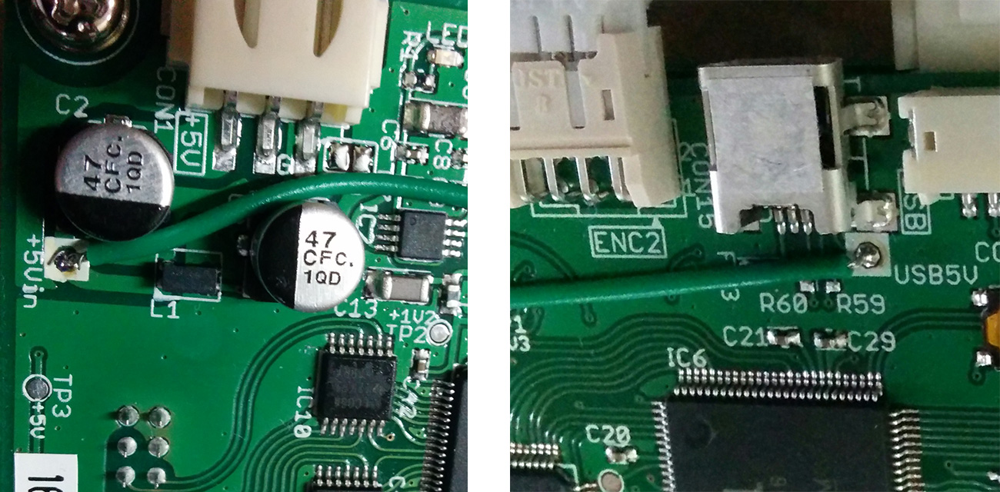

1. 半田付けがうまく行えているか確認 (オーガナイザーまたはTAに声をかけてください)  
  _注意：「CON1」から5Vを供給して利用する場合には、ここで半田付けした電線を切除してください。そのままで「CON1」から5Vを供給すると、モータドライバおよびUSBで接続しているPCが破損する可能性があります。_{:style="color: red"}

## ロボットの組立て

1.  天板にモータマウントをネジ止め  
  表からM5のネジを軽く留める  
  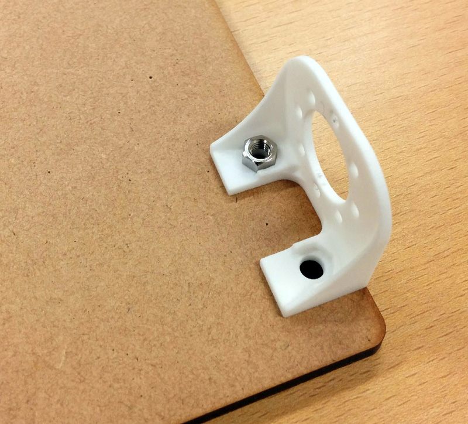  
  同様にもう一本もネジ留め  
  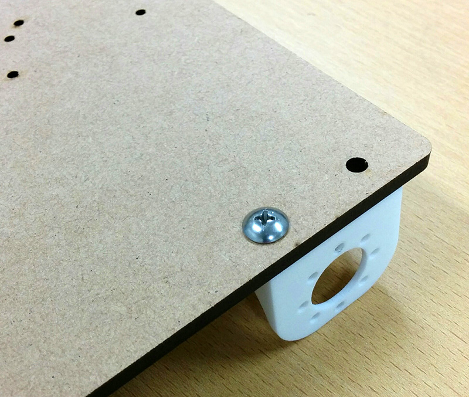  
  反対側のモータマウントも同様に取り付け  
  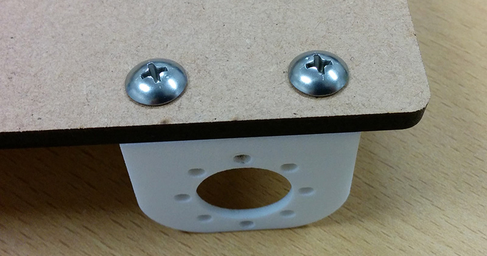  
  モータマウント裏側の溝に、M5のナットをはめ込み  
  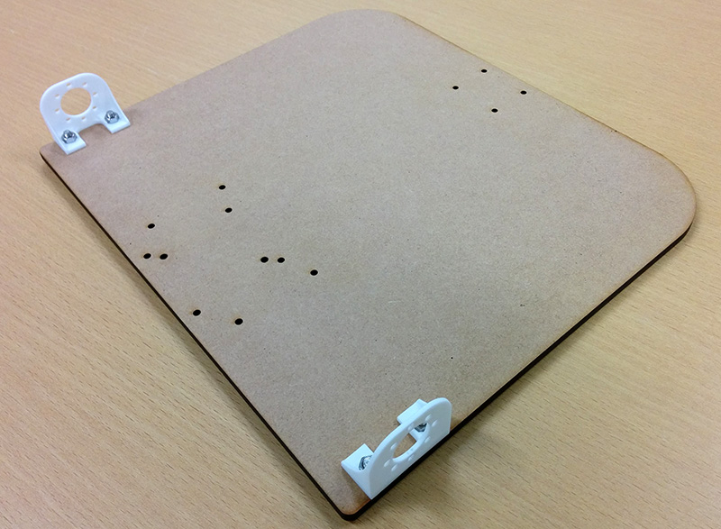

1.  モータマウントにモータをネジ止め  
  モータをモータマウントにはめ込み  
  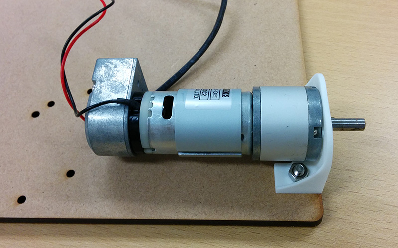  
  モータマウント側面の穴から、M3のネジ _（ネジ頭が小さく、ワッシャーが入っているもの）_{: style="color: red" } 4本でモータを固定  
  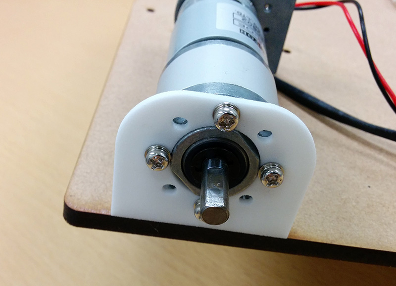  
  反対側のモータも同様に取り付け  
  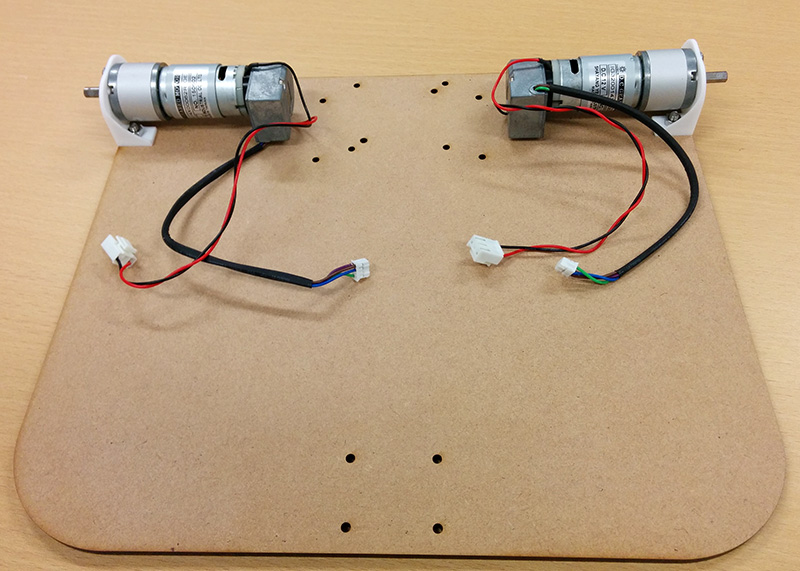

1.  天板に測域センサをネジ止め  
  天板の表側に、写真の向きにURGを載せる  
  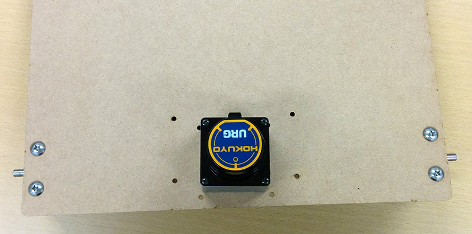  
  裏面からM3のネジ2本で固定  
  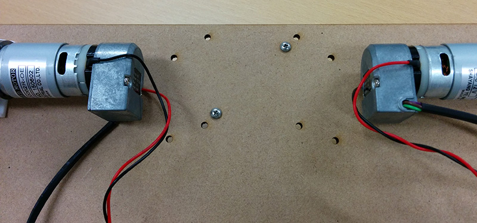

1.  天板にキャスターをネジ止め  
  天板の表側からM4のネジを挿入し  
  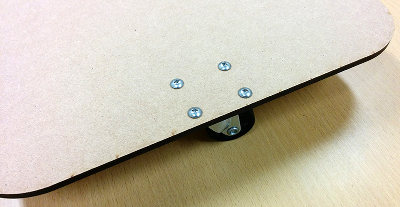  
  裏面からM4のナットで固定  
  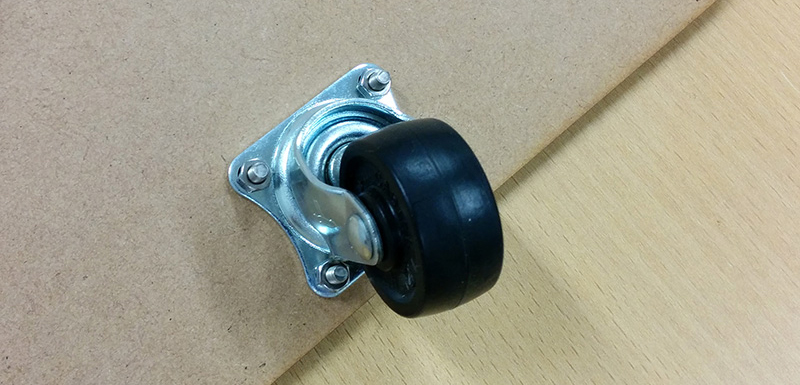

1.  モータにホイールをイモネジ止め  
  モータ軸のDカット(平らな面)に、ホイールのイモネジが入っているねじ穴を合わせ、六角レンチでイモネジを締めて固定  
  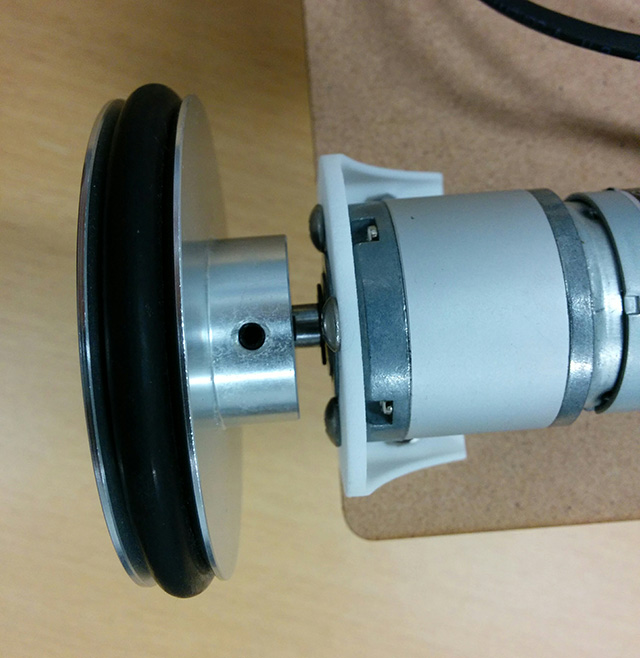

1.  天板にモータドライバをネジ止め  
  天板の裏面に、写真の向きでモータドライバを載せ  
  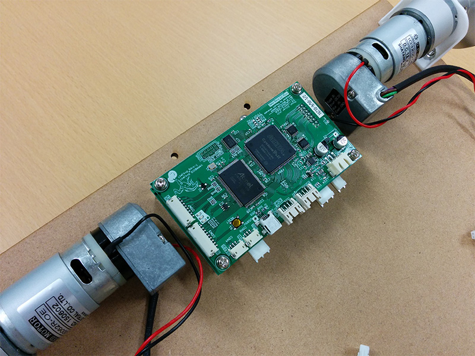  
  表面からM3のネジで固定  
  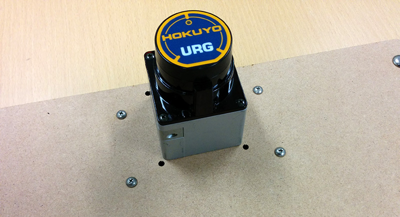

1.  天板に電池ボックスを貼り付け  
  天板の裏面に、写真の向きで、両面テープを用いて電池ボックスを固定  
  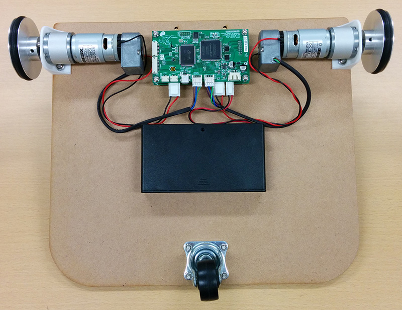  
  貼り合わせ後、よく押しつけて、_接着面同士を十分に密着_{:style="color: red"}させます。_接着力を発揮させるため、貼り付け後5分間は、電池ボックスが上側にある状態を維持して下さい。_{:style="color: red"}

1.  配線  
  モータ・電池ボックスのケーブルをモータドライバに接続  
  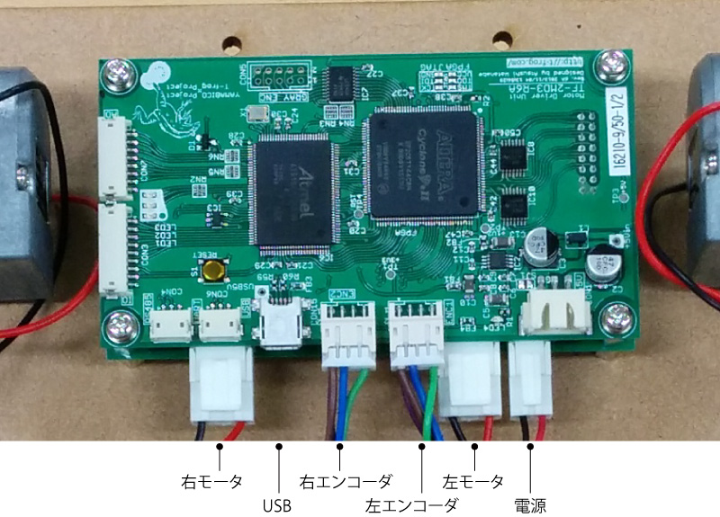  

以上でロボットの組み立ては完了です。  


## 昨年以前のロボットのメンテナンス

2014年、2015年、2016年のロボットを使用する場合、ネジ類が緩んでいないか確認しましょう。特に、ホイールをモータに固定しているイモネジの緩みに注意して下さい。

## 初期設定

1.  ノートPCでUbuntuを起動

1.  USBデバイスを開けるように、使用しているユーザをdialoutグループに追加
```shell
$ sudo adduser [ YOUR_USER_NAME ] dialout
```

1.  上記設定を反映するため、画面右上のアイコンから、ログアウトを選択してログアウト

1.  ログイン画面から再度ログイン

## 制御ソフトのインストールと動作テスト

1.  画面左のランチャーから「端末」を起動し、下記コマンドを実行して制御ソフトをインストール
```shell
$ cd ~/Downloads/
$ git clone https://github.com/openspur/yp-spur.git
$ cd yp-spur
$ mkdir build
$ cd build
$ ../configure
$ make
$ sudo make install
$ sudo ldconfig
```  
  ロボットパラメータファイルをダウンロードします。  
  (2015年度・2016年度・2018年度のロボットの場合)
```shell
$ mkdir ~/params
$ cd ~/params/
$ wget https://at-wat.github.io/ROS-quick-start-up/files/rsj-seminar2016.param
```  
  (2014年度のロボットの場合)
```shell  
$ mkdir ~/params
$ cd ~/params/
$ wget https://at-wat.github.io/ROS-quick-start-up/files/rsj-seminar2014.param
```
1.  ロボットの電池ボックスに電池を挿入

1.  電池ボックスの側面にあるスライドスイッチをON

1.  モータドライバのUSBをPCに接続

1.  端末を開いて、下記コマンドで制御ソフトを起動
```shell
$ ypspur-coordinator -p ~/params/rsj-seminar20??.param【該当するものに置き換えること】 -d /dev/serial/by-id/usb-T-frog_project_T-frog_Driver-if00
```

1.  ホイールを持ち上げて走り出さない状態、もしくは、ひっくり返してホイールが浮いている状態にしてサンプルプログラムを起動 (端末をもう1つ開いて実行します。)
```shell
$ cd ~/Downloads/yp-spur/build
$ ./samples/run-test
```  
  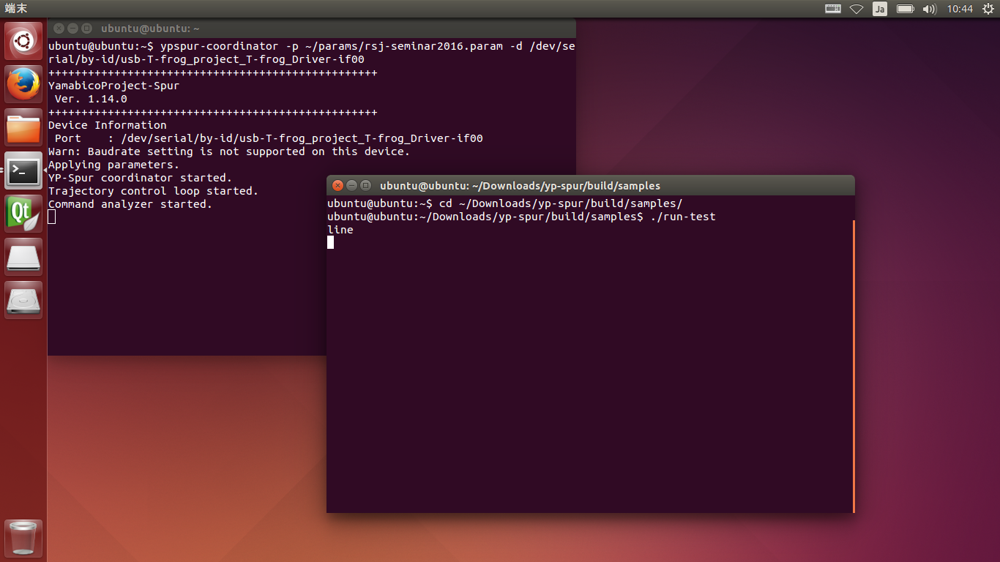  
  ホイールが回転して、回転方向を何度か変え、最終的に止まることを確認したら、__Ctrl+c__{:style="border: 1px solid black"}で停止させます。このとき、ypspur-coordinatorは、まだ停止させないで下さい。(停止させた場合はもう一度起動)

1.  床の広い場所でサンプルプログラムを起動
```shell
$ ./samples/run-test
```  
  1m x 0.1m の四角形を描いてロボットが移動することを確認します。最後に、サンプルプログラムと、ypspur-coordinatorを  __Ctrl+c__{:style="border: 1px solid black"}  で停止させます。

1.  電池ボックスのスライドスイッチをOFF (待機電力で電池の電力を消費してしまいます)
