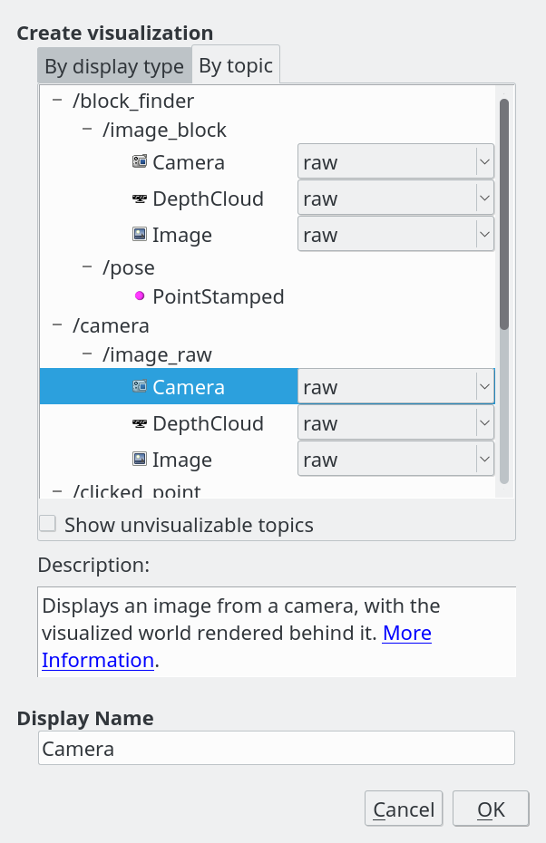

- Table of contents
{:toc}

全セクションでマニピュレータを制御するノードと画像処理でブロックの位置を見つけるノードを作成しました。本セクションでは、これらのノードを組み合わせてアプリケーションを作成します。

## アプリケーションの概要

テーブルにブロックを置くとマニピュレータはブロックを移動するというタスクを行うアプリケーションを作成します。このような、センサーで見つけた物を移動するタスクは産業にもサービスにもよく利用されます。

ROSでは、ノード作成ではなくてノードの組み合わせによってアプリケーションを作ることがよくあります。本アプリケーションも同様に、本セミナーで作成したマニピュレータ制御ノードを画像処理ノードを組み合わせてアプリケーションを作成します。ノード構造は以下のようになります。


どのノードを起動するか等を定義するlaunchファイルの作成本アプリケーション作成の作業のほぼ全部です。

## ワークスペースのセットアップ

アプリケーション用の新しいワークスペースを作りましょう。

```shell
$ mkdir -p ~/rsj_2017_application_ws/src
$ cd ~/rsj_2017_application_ws/src
$ catkin_init_workspace
```

本ワークスペースにマニピュレータ制御ノードと画像処理ノードをコピーします。

```shell
$ cd ~/rsj_2017_application_ws/src
$ cp -r ~/crane_plus_ws/src/pick_and_placer .
$ cp -r ~/block_finder_ws/src/rsj_2017_block_finder .
```

自分で作ったノードの代わりに、本セミナーに用意されたノードの利用も可能です。パッケージごとのクローンするためのコマンドは下記の通りです。

- `pick_and_placer`　（マニピュレータ制御ノード）
: ```shell
  $ cd ~/rsj_2017_application_ws/src
  $ git clone https://github.com/gbiggs/rsj_2017_pick_and_placer.git
  $ cd ~/rsj_2017_pick_and_placer
  $ git checkout full_application_version
  ```
  _注意：パッケージ名が自分製パッケージと異なります。下記の説明で`pick_and_placer`と書いているところに`rsj_2017_pick_and_placer`を利用してください。_

- `block_finder`　（ブロックを見つける画像処理ノード）
: ```shell
  $ cd ~/rsj_2017_application_ws/src
  $ git clone https://github.com/Suzuki1984/rsj_2017_block_finder
  ```
  _注意：パッケージ名が自分製パッケージと異なります。下記の説明で`block_finder`と書いているところに`rsj_2017_block_finder`を利用してください。_

他の必要なノードもワークスペースに入れます.

```shell
$ cd ~/rsj_2017_application_ws/src
$ git clone https://github.com/gbiggs/crane_plus_arm.git
$ git clone https://github.com/ros-drivers/usb_cam.git
```

最後に、ワークスペースをビルドします。（今はしなくてもいいが、ワークスペースに入れたソフトウェアのビルドに問題がないかを確認するためです。）

```shell
$ cd ~/rsj_2017_application_ws
$ catkin_make
Base path: /home/geoff/rsj_2017_application_ws
Source space: /home/geoff/rsj_2017_application_ws/src
Build space: /home/geoff/rsj_2017_application_ws/build
Devel space: /home/geoff/rsj_2017_application_ws/devel
Install space: /home/geoff/rsj_2017_application_ws/install
（省略）
[100%] Linking CXX executable /home/geoff/rsj_2017_application_ws/devel/lib/
         crane_plus_camera_calibration/calibrate_camera_checkerboard
[100%] Built target calibrate_camera_checkerboard
```

## カメラ姿勢のカリブレーション

カメラのマニピュレータに対しての位置を計算します。

カメラから見たブロックの姿勢をマニピュレータから見た座標系に変更するために、マニピュレータの座標系の中のカメラの姿勢が必要です。位置（XYZ）を図ることはできますが、正確さは劣るし、角度は測りにくいし、おすすめではありません。

代わりに計算します。このために、`crane_plus_arm`の中に`crane_plus_camera_calibration`というパッケージがあります。このパッケージは、CRANE+マニピュレータとカメラの姿勢を計算します。下記の手順で行います。

まずはハードウェアを準備します。マニピュレータを机で設置し、カリブレーションボードをマニピュレータの前に置きます。カメラを三脚の上に載せ、下記を実行してカメラはカリブレーションボードが見えるように調整します。カリブレーションボードの上に何もないようにしてください。

```shell
$ cd ~/rsj_2017_application_ws
$ source devel/setup.bash
$ roslaunch usb_cam usb_cam-test.launch
```


カメラを正しい方向に向けたら、 __Ctrl+c__{: style="border: 1px solid black" } で終了します。

カリブレーション手順中に手でマニピュレータを移動することが必要です。しかしモータがトルクを与えている状態で手で移動すると、モータ内の歯車を壊す可能性があります。このために、カリブレーションを行う前にトルクを切ります。

```shell
$ cd ~/rsj_2017_application_ws
$ source devel/setup.bash
$ rosrun crane_plus_hardware set_arm_torque off
Turning torque off for motor 1
done
Turning torque off for motor 2
done
Turning torque off for motor 3
done
Turning torque off for motor 4
done
Turning torque off for motor 5
done
```

_エラーが出る場合もあります。エラーがないようになるまでに最後のコマンドを繰り返して実行してください。_

次にマニピュレータのハードウェアを起動します。端末で下記を実行します。

```shell
$ cd ~/rsj_2017_application_ws
$ source devel/setup.bash
$ roslaunch crane_plus_hardware start_arm_standalone.launch
```

カメラも起動することが必要です。新しい端末で下記を実行します。

```shell
$ cd ~/rsj_2017_application_ws
$ source devel/setup.bash
$ rosrun usb_cam usb_cam_node __name:=camera _camera_name:="elecom_ucam" \
    _camera_frame_id:="camera_link" _video_device:="/dev/video0" _image_width:=640 \
    _image_height480 _pixel_format:=yuyv _io_method:=mmap
```

カメラは`world`座標系に対してカリブレーションします。でも、`crane_plus_hardware`の`start_arm_standalone.launch`はマニピュレータを`base_link`座標系に置きます。一時的に`world`と`base_link`の関係を示すことが必要です。新しい端末で下記を実行すると、`world`と`base_link`の差を`tf`に送信します。（ゼロにしたので、`world`と`base_link`の中央点は一緒だと示しています。）

```shell
$ rosrun tf static_transform_publisher 0 0 0 0 0 0 world base_link 10
```

そして、カリブレーションプロセス自体を始めます。上記と同じ端末で下記を実行します。

```shell
$ roslaunch crane_plus_camera_calibration calibrate.launch
（省略）
[ INFO] [1496372099.962924251]: [calibrate] Initialized.
[ INFO] [1496372100.144910497]: [calibrate] Got image info!
Got an image callback!
Is the checkerboard correct?
Move edge of gripper to point 1 in image and press Enter.
```

カメラカリブレーションプロセスが始まると以下の画像表示が現れます。


_自分の画面に出る画像をよく確認してください。１〜４で示されたポイントの順番が大事です。_{:style="color: red"}

そして端末で支持が表示されます。

```shell
Move edge of gripper to point 1 in image and press Enter.

Move edge of gripper to point 2 in image and press Enter.

Move edge of gripper to point 3 in image and press Enter.

Move edge of gripper to point 4 in image and press Enter.

```

指示通りに、マニピュレータの指先を4つのポイントに合わせて、ポイントづつに __Enter__{: style="border: 1px solid black" } を押します。


すべてのポイントに合わせたら、姿勢が計算されます。以下のように姿勢が出力されます。

```shell
Resulting transform (camera frame -> fixed frame):
-0.00810475    0.988067    -0.15381   0.0112857
    0.97487   -0.026437     -0.2212    -0.12158
  -0.222626   -0.151737   -0.963023     0.60675
          0           0           0           1

Resulting transform (fixed frame -> camera frame):
 -0.0081048    0.988067    -0.15381   0.0112857
    0.97487   -0.026437     -0.2212    -0.12158
  -0.222626   -0.151737   -0.963023     0.60675
4.59121e-41 4.58323e-41 4.58323e-41           1

Static transform publisher:
rosrun tf static_transform_publisher x y z qx qy qz qw frame_id child_frame_id period_in_ms
rosrun tf static_transform_publisher 0.253695 0.0777012 0.559156 0.703803 0.697261 -0.133715 \
  -0.0246739 /base_link /camera_link 100

URDF output:
<?xml version="1.0"?>
<robot>
        <property name="calib_cam_x" value="0.253695" />
        <property name="calib_cam_y" value="0.0777012" />
        <property name="calib_cam_z" value="0.559156" />
        <property name="calib_cam_rr" value="-2.91582" />
        <property name="calib_cam_rp" value="0.154423" />
        <property name="calib_cam_ry" value="1.579" />
        <property name="calib_frame_name" value="world" />
</robot>
```

_必ずこの情報を保存してください。これからの手順に必要です。_{:style="color: red"}

全端末で __Ctrl+c__{: style="border: 1px solid black" } を押して終了します。

## アプリケーション用のパッケージを作成

### パッケージ作成

本アプリケーションにはノード作成が必要ありませんが、アプリケーションのノード構造等を定義するlaunchファイルを作成することが必要です。launchファイルをパッケージに保存すると扱いやすいです。このためのパッケージを作成します。

パッケージは、`catkin_create_pkg`で作成します。依存する他パッケージとして、launchファイルで利用する他パッケージをしていします。直接依存するパッケージのみの指定が必要です。非直接の依存パッケージは他パッケージの依存関係で`catkin_make`が対応してくれます。

```shell
$ catkin_create_pkg rsj_2017_application pick_and_placer rsj_2017_block_finder \
    crane_plus_description crane_plus_hardware usb_cam
Created file rsj_2017_application/package.xml
Created file rsj_2017_application/CMakeLists.txt
Successfully created files in /home/geoff/rsj_2017_application_ws/src/rsj_2017_application.
  Please adjust the values in package.xml.
```

本パッケージにソースを入れないので、`CMakeLists.txt`の編集は必要ではありません。

### ハードウェア構成を定義

アプリケーションのハードウェアにはマニピュレータだけでなくて、カメラもあります。全ハードウェアをURDFファイルに定義すると上記で計算したカメラの姿勢が定義しやすいです。

以下のデイレクトリーを作製して、中に`work_cell.urdf.xacro`というファイルを作成します。

```shell
$ cd ~/rsj_2017_application_ws/src/rsj_2017_application
$ mkdir urdf
```

エディターで新しいファイルを作成して、`~/rsj_2017_application_ws/src/rsj_2017_application/urdf/work_cell.urdf.xacro`として保存します。内容は下記の通りにします。

```xml
<?xml version="1.0" ?>
<robot name="work_cell"
    xmlns:controller="http://playerstage.sourceforge.net/gazebo/xmlschema/#controller"
    xmlns:interface="http://playerstage.sourceforge.net/gazebo/xmlschema/#interface"
    xmlns:sensor="http://playerstage.sourceforge.net/gazebo/xmlschema/#sensor"
    xmlns:xacro="http://ros.org/wiki/xacro">

  <!-- Include the Crane+ generator macro -->
  <xacro:include filename="$(find crane_plus_description)/urdf/crane_plus.xacro"/>

  <!-- A link to provide the location reference of the work cell -->
  <link name="world"/>

  <!-- A link from the world to the robot's base link -->
  <link name="base_link"/>
  <joint name="world_to_base_link" type="fixed">
    <parent link="world"/>
    <child link="base_link"/>
    <origin xyz="0 0 0" rpy="0 0 0"/>
  </joint>

  <!-- Place a Crane+ manipulator at the centre of the world -->
  <crane_plus parent="base_link"
              servo_color="black" bracket_color="grey" gripper_color="black"
              joints_vlimit="1.571"
              pan_llimit="-2.617" pan_ulimit="2.617">
    <origin xyz="0 0 0"/>
  </crane_plus>

  <!-- Place a camera in the world with a link that can be calibrated -->
  <link name="camera_link"/>
  <joint name="camera" type="fixed">
    <parent link="world"/>
    <child link="camera_link"/>
    <origin xyz="0.38019 -0.00749503 0.513993" rpy="-2.70665 0.0167343 1.55906"/>
  </joint>
</robot>
```

計算したカメラの姿勢を上記のファイルに定義します。27行目にある`<origin xyz="0 0 0" rpy="0 0 0"/>`を編集して、カメラカリブレーションが出力した位置と角度を入力します。

例えば、カメラカリブレーションが姿勢として以下を出力したら：

```
<property name="calib_cam_x" value="0.253695" />
<property name="calib_cam_y" value="0.0777012" />
<property name="calib_cam_z" value="0.559156" />
<property name="calib_cam_rr" value="-2.91582" />
<property name="calib_cam_rp" value="0.154423" />
<property name="calib_cam_ry" value="1.579" />
```

27行目を下記のように変更します。

```xml
<origin xyz="0.253695 0.0777012 0.559156" rpy="-2.91582 0.154423 1.579"/>
```

これで既存のハードウェア定義を再利用してアプリケーションのハードウェアを定義しました。そして現在のカメラの位置にこの定義を合わせました。

_このソースは以下のURLでダウンロード可能です。_

<https://github.com/gbiggs/rsj_2017_application/blob/master/urdf/work_cell.urdf.xacro>

### launchファイル作成

以下のディレクトリーを作成します。

```shell
$ cd ~/rsj_2017_application_ws/src/rsj_2017_application
$ mkdir launch
```

そして、本ディレクトリー内に`start_app.launch`というファイルを作成します。下記は最初の内容です。エディターで新しいファイルを作成し下記の内容をいれて、`~/rsj_2017_application_ws/src/rsj_2017_application/launch/start_app.launch`として保存します。

```xml
<launch>
</launch>
```

これからアプリケーションを起動するためのノードやパラメータなどを定義します。

ハードウェアを利用するアプリケーションを作成すると、基本的`robot_description`というパラメータにハードウェア定義をロードすることが必要です。全セクションで作成したURDFファイルはここで利用します。`start_app.launch`が下記の通りになるように編集します。

```xml
<launch>
  <param name="robot_description"
    command="$(find xacro)/xacro --inorder '$(find rsj_2017_application)/urdf/work_cell.urdf.xacro'"/>
</launch>
```

次はマニピュレータのハードウェアへアクセス・制御するノードを起動します。

ROSのlaunchファイルは他のlaunchファイルをインクルードすることができます。今回インクルード機能を利用することによって、マニピュレータのハードウェア用のノードを起動します。

`start_app.launch`に下記を追加します。

```xml
  <include file="$(find crane_plus_hardware)/launch/start_arm.launch"/>
```

MoveIt!も起動することが必要です。上記と同様にインクルードできます。

```xml
  <include file="$(find crane_plus_moveit_config)/launch/move_group.launch"/>
```

カメラは単体なノードのでインクルードできるlaunchファイルはありません。カメラハードウェア用のノードを起動するために下記を`start_app.launch`に追加します。

```xml
  <node name="camera" pkg="usb_cam" type="usb_cam_node" output="screen">
    <param name="camera_name" value="elecom_ucam"/>
    <param name="camera_frame_id" value="camera_link"/>
    <param name="video_device" value="/dev/video0"/>
    <param name="image_width" value="640"/>
    <param name="image_height" value="480"/>
    <param name="pixel_format" value="yuyv"/>
    <param name="io_method" value="mmap"/>
  </node>
```

__注意：上記の中の`/dev/video0`を必要におおじて自分のハードウェアに合わせて変更してください。__{:style="color: red"}

ハードウェアを起動したので、つぎにピック・アンド・プレースのノードを起動します。下記をラウンチファイルに追加します。

```xml
  <node name="pickandplace" pkg="pick_and_placer" type="pick_and_placer" output="screen">
    <remap from="/block" to="/block_finder/pose"/>
  </node>
```

上記のノードは今までと少し違います。`<remap>`タグを利用しています。

マニピュレータ制御セクションで作成した`pick_and_placer`ノードは`/block`というトピックでブロックの位置を受信するとして実装しました。しかし、画像処理セクションで作成した`block_finder`ノードは、`/block_finder/pose`というトピックでブロックの位置を送信しています。

ROSでは、このようなトピック名が合わない状況は非常に多いです。まるで普通の状態なので、ROSは簡単な対応方法を持ちます。これは「topic remapping」です。ノードを起動するときに、ノードのパブリッシュとサブスクライブするトピック名を変更する機能です。

launchファイルでこの機能を利用するために、`<node>`タグ内に`<remap>`タグを利用します。上記の定義は、このノードが`/block`というトピック名を利用すると自動的に`/block_finder/pose`に変更します。すなわち、`pick_and_placer`ノードは`/block`ではなくて、`/block_finder/pose`トピックにサブスクライブします。これで`block_finder`と`pick_and_placer`は、ソースを変更せずに繋がれるようにしました。

最後に、`block_finder`を起動します。こちらにもトピック名をtopic remappingで変更します。

```xml
  <node name="block_finder" pkg="rsj_2017_block_finder" type="block_finder" output="screen">
    <remap from="/usb_cam_node/camera_info" to="/camera/camera_info"/>
    <remap from="/usb_cam_node/image_raw" to="/camera/image_raw"/>
  </node>
```

上記により、アプリケーションを起動するlaunchファイルを作成しました。これでアプリケーションの実装が完成です。

_このソースは以下のURLでダウンロード可能です。_

<https://github.com/gbiggs/rsj_2017_application/blob/master/launch/start_app.launch>

_パッケージ全体は下記のURLでダウンロード可能です。_

<https://github.com/gbiggs/rsj_2017_application>

## システムを起動

こどで、全セクションで作ったアプリケーションを実行します。実行の前に、まずはハードウェアをつなげて電源を入れます。

アプリケーションの起動は`roslaunch`で行います。新しい端末で下記を実行します。

```shell
$ cd ~/rsj_2017_application_ws
$ source devel/setup.bash
$ roslaunch rsj_2017_application start_app.launch
```

アプリケーションの動きが見えるように、RVizも起動します。

```shell
$ cd ~/rsj_2017_application_ws
$ source devel/setup.bash
$ rviz
```

左側のパネル内に「Global Options」の「Fixed Frame」を`world`に設定します。

「RobotModel」、「TF」、「PlanningScene」、「Trajectory」および「Camera」の可視化を追加します。

「Trajectory」の可視化オプションで「Loop animation」をオンにします。


「TF」の可視化オプションで「Marker scale」をより小さい値にすると見やすくなります。


また、「TF」の可視化オプションで「Frames」を開いて可視化されるフレームの変更でほしいフレームだけの選択ができます。

「Camera」の可視化は「By Topic」で追加し、`/camera/image_raw`を選択します。



表示されるカメラ画像では、ロボットの可視化モデルも表示されます。カメラカリブレーションは成功であったら、ハードウェアロボットと一致します。


マニピュレータの前にブロックを置いたら、`block_finder`はブロックの位置を判断して`pick_and_placer`に送信します。そしてマニピュレータはそのブロックを移動しようとします。


<video width="712" height="400" controls poster="files/pick_and_place.png" markdown="0">
  <source src="files/pick_and_place.webm" type="video/webm;codecs=vp9,vorbis" markdown="0">
  <source src="files/pick_and_place.mp4" type="video/mp4" markdown="0">
  
</video markdown="0">

下記は本アプリケーションの起動中のノードとトピックです。既存のパッケージを利用すると、URDF一つとlaunchファイル一つでこのような複雑なシステムの実現は可能です。


