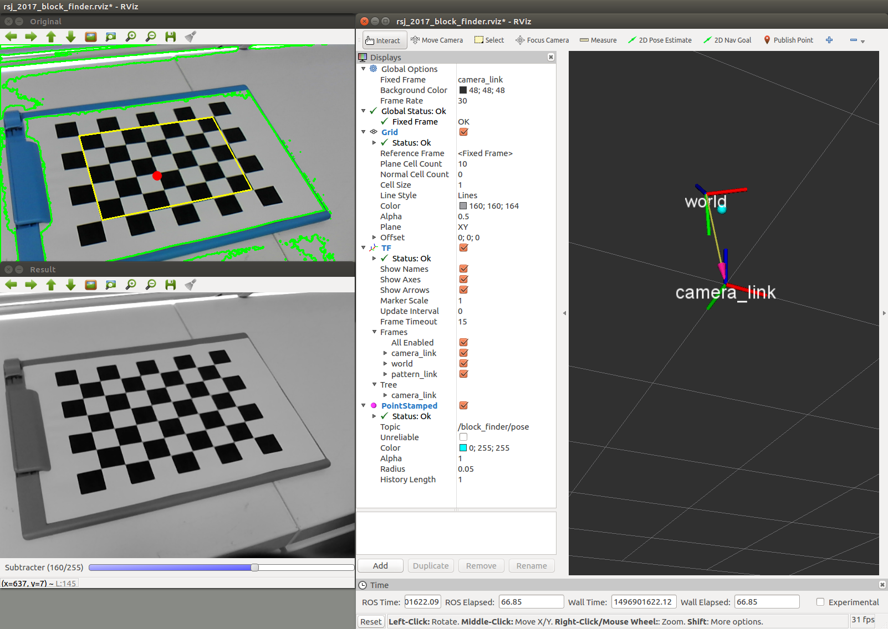

本セクションでは、前セクションで取得した画像を処理する方法について説明します。特にOpenCVを用いて処理する方法について説明します。

本セクションでは、ブロックを見つけ、その位置（Ｘ座標とＹ座標）を出力する一連の処理について説明します。

# OpenCV

OpenCV（Open Source Computer Vision Library）は無料の画像処理ライブラリーです。Linuzの他、WiondowsやMacOSでも利用することができ、現在、多くの画像処理研究で利用されてます。例えば、OpenCVを利用することで、従来手法との精度比較を簡単に行うことができます。

ROSでOpenCVを利用するときの注意点としては、バージョン管理があります。ROSがリリースされたときの最新バージョンのOpenCVを使用することになります。ROSのバージョンとOpenCVのバージョンの対応表をまとめておきます。本セミナーはROS16.04を使用しているため、OpenCV3を利用することになります。

|ROSのバージョン|OpenCVのバージョン|
|17.04 (Lunar Loggerhead)|3|
|16.04 (Kinetic Kame)|3|
|15.04 (Jade Turtle)|2|
|14.04 (Indigo Igloo)|2.4.8|

OpenCVはバージョンが変わると、記述方法や機能が大幅に変更されます。例えば、2から3へバージョンが変わったときは、KNNなどの画像処理が追加されましたが、フレーム間差分などの画像処理などはcontribなどの追加パッケージへ移動されました。


# 事前準備

本セミナーではパッケージ『cv_bridge』を利用します。このパッケージはROSの画像データ（Image Message）とOpenCVの画像データ（IplImage）を相互に変換することができます。つまり、IplImageへ変換し、処理を施し、Image Messageへ戻すという一連の処理を記述することができます。

```shell
sudo apt-get install ros-kinetic-cv-camera
```
IplはIntel Image Processing Libraryの略で、バージョン1で使用されている型になります。そのため、本セミナーでは更にIplImageをMatへ変換します。

# セミナー用画像処理パッケージの作成

新しいワークスペースを作成します。

```shell
$ mkdir -p ~/block_finder_ws/src/
$ cd ~/block_finder_ws/src/
$ catkin_init_workspace
$　ls
CMakeLists.txt
```

次にセミナー用画像処理のROSパッケージをダウンロードします。

```shell
$ git clone git@github.com:Suzuki1984/rsj_2017_block_finder.git

stl-ws2017@stl-ws2017:~/block_finder_ws/src$ ls
CMakeLists.txt  rsj_2017_block_finder
```

コンパイルします。エラーが出ず、[100%]となることを確認します。

```shell
$ cd ~/block_finder_ws/
$ catkin_make 
```

ワークスペース内のパッケージが利用できるようにワークスペースをソースします。

```shell
$ source devel/setup.bash
```

これでセミナー用画像処理のパッケージ「rsj_2017_block_finder」が利用可能になりました。

# セミナー用画像処理パッケージの内容

セミナー用画像処理パッケージの内容を確認します。

```shell
$ ls
CMakeLists.txt  launch  package.xml  readme.md  rsj_2017_block_finder.rviz  src
```

ディレクト「launch」の中にはblock_finder.launchがあります。このlaunchファイルでは4つのノードを起動します。配信（publish）と購読（listen）の関係性を以下に示します。

```shell
<?xml version="1.0"?>
<launch>
 <node pkg="usb_cam" type="usb_cam_node" name="usb_cam_node" output="screen">
  <param name="image_width" value="640"/>
  <param name="image_height" value="480"/>
  <param name="pixel_format" value="yuyv"/>
  <param name="camera_frame_id" value="camera_link"/>
 </node>
 <node pkg="rsj_2017_block_finder" type="block_finder" name="block_finder" output="screen"/>
 <node pkg="tf" type="static_transform_publisher" name="camera_transform_publisher" args="-0.118 -0.039 0.474 -0.293 -0.075 -0.191 0.934 /camera_link /world 100"/>
 <node pkg="rviz" type="rviz" name="rviz" args="-d $(find rsj_2017_block_finder)/rsj_2017_block_finder.rviz"/>
</launch>
```

`usb_cam_node`
: 画像メッセージを配信する。

`block_finder`
: 画像メッセージを購読し、処理し、世界座標系におけるブロックの位置を配信する。

`camera_transform_publisher`
: 世界座標系の原点から見たカメラ座標系の原点の位置を配信する。

`rviz`
: 世界座標、カメ座標系、ブロックの位置関係を確認する。

# セミナー用画像処理プログラムの内容

カメラを接続し、チェスボードを机の上に置いたあと、下記のコマンドで実行します。入力画像、出力画像、RVizの３つの画面が開きます。チェスボード上に黄色の四角形が表示されていれば正常に起動しています。

```shell
$ roslaunch rsj_2017_block_finder block_finder.launch
```



次に、チェスボードを退かし、黄色の四角形に収まるようにブロックを置きます。

TFは座標系を表示し、R色がX軸、G色がY軸、B色がZ軸を表します。

PointStampedはHeaderとPointが組み合わさったメッセージで、Headerで位置データを取得した時刻、Pointで位置データを表現することができます。

## ブロックの検出

まず、関数「threshold」で入力画像を２値化する。第３引数が閾値となり、スライドバーで変更する。

次に、関数findContoursを使用する。第３引数が近似手法となり、現在はCV_CHAIN_APPROX_NONEとなっています。CV_CHAIN_APPROX_SIMPLEやCV_CHAIN_APPROX_TC89_L1に変更して、結果の違いを確認してください。


# 発展

チェスボードの上でもブロックを検出できるようにする。

背景差分を利用する。


