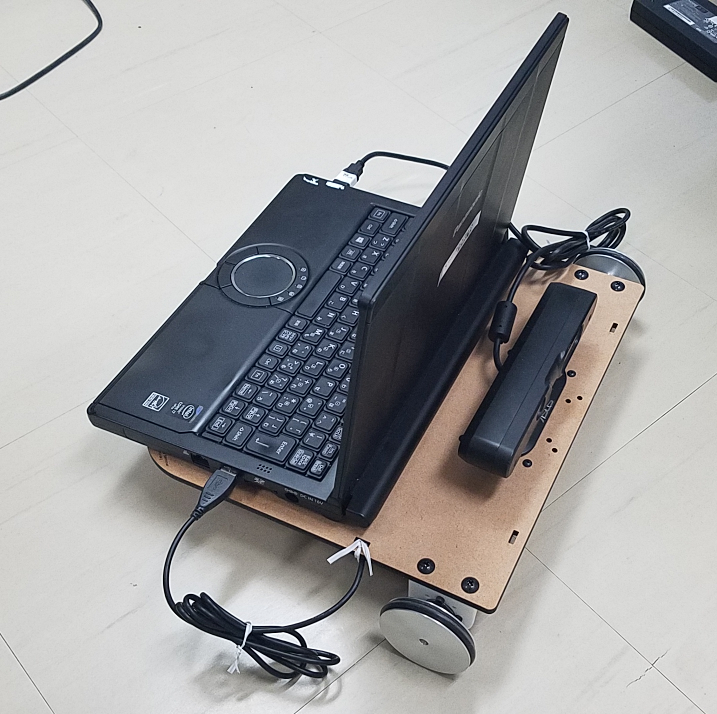

# ロボットの作り方 ～移動ロボットの制御とROSによる動作計画実習～

## セミナーに必要な物品の準備

下記3点を*必ず*{: style="color: red"}持参してください。

- 実習に使用するノートPC
  - Ubuntu Linux(64bit必須)とROSを事前にインストールしてください
  - インストール方法は以下の[事前準備](#事前準備)を参考にしてください
  - USBポートを2つ以上持つタイプか、ポート数が足りない場合はUSBハブをご用意ください
  - LANポートを1つ持つタイプか、ない場合はUSB-LANアダプタをご用意ください
- USB A-miniBケーブル (長さ50cm程度) 2本
- 単三乾電池 8本(充電池も可)
  - たくさん動かすと2日間持たない場合がありますので、予備の電池を追加で8本程度ご用意頂くと安心です。なお、会場付近に電気店がありますので、当日そちらで購入することも可能です。

下記3点は、可能であれば持参してください。(用意できない場合は貸し出します。)
- プラスドライバ (M3～M5のネジを締められるもの)
- 六角レンチセット
- モバイルルーターなどのインターネット接続機器 (会場でもWiMAX回線を用意しますが、速度が遅くなる可能性があるため、可能であれば持参をお願いします。)

- 教材として用いるロボットは[i-Cart edu](http://t-frog.com/products/icart_edu/)です。PC が載るスペースとしては幅約 32cm 奥行き約 20cm 程度となります。もちろんこの大きさ以上の PC でも構いませんが選定の目安としてください。[Lets' note CF-SX4](https://panasonic.biz/cns/pc/prod/asia/sx/) と Xtion PRO Live を搭載した様子は以下のようになります。

不明な点や、事前準備がうまく行かない点については、オーガナイザまでお問い合わせ下さい。

## 事前準備

- [Ubuntu LinuxとROSのインストール](linux_and_ros_install.html)
- [Linuxの基本操作](linux_basics.html)

## スケジュール

### 1日目（6/16）

|10:00-12:00|実習1-1 ロボットの組み立てと動作テスト|
|12:00-13:00|昼休み|
|13:00-14:00|講義1 「モータ制御・ロボット動作制御の理論」講師：渡辺敦志 （SEQSENSE）|
|14:00-15:00|実習1-2 ROSプログラミングの基本|
|15:00-17:30|実習1-3 ROSを用いた点群取得|
|15:00-17:30|実習1-4 ROSの便利機能|

### 2日目（6/17）

|10:00-11:00|講義2 「ROSを用いた自律移動ロボットのシステム構築」講師：渡辺敦志 （SEQSENSE）|
|11:00-12:00|実習2-1 ROS Navigationパッケージの利用|
|12:00-13:00|昼休み|
|13:00-13:30|実習2-2 3次元点群の処理 、PointCloud に対するフィルタ|
|13:30-16:30|実習2-3 点群処理とロボットナビゲーションの統合|
|16:30-17:00|課題と質疑|

スケジュールは、演習の進行に応じて多少変更する場合があります。

## 参考情報

- [ROS Japan UG （日本のユーザ会）](https://rosjp.connpass.com/)
- [ROSのメッセージボード](https://discourse.ros.org/)
- [ROS Answers](http://answers.ros.org/)（日本語でも大丈夫です。）
- [Programming Robots with ROS](http://shop.oreilly.com/product/0636920024736.do)
