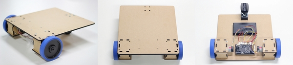
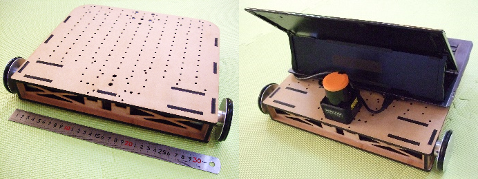
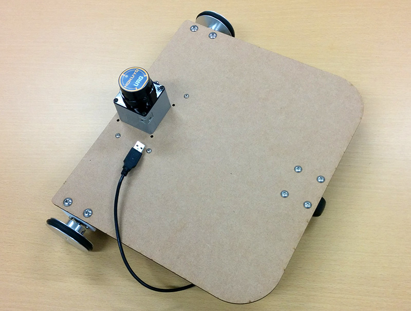

# 参考資料: ロボットの見分け方

本セミナーは、2014年からシリーズで開催しており、以前の回のセミナーの教材ロボットも使用できます。
2014年版のみ、ロボットのパラメータファイルが異なりますのでご注意ください。
各開催年毎のロボットの外観は以下のとおりです。

## 2014年度の教材ロボット外観

2014年度用パラメータファイルを利用してください。

## 2015年度の教材ロボット外観

2016年度用パラメータファイルを利用してください。

## 2016年度以降の教材ロボット外観

2016年度用パラメータファイルを利用してください。

