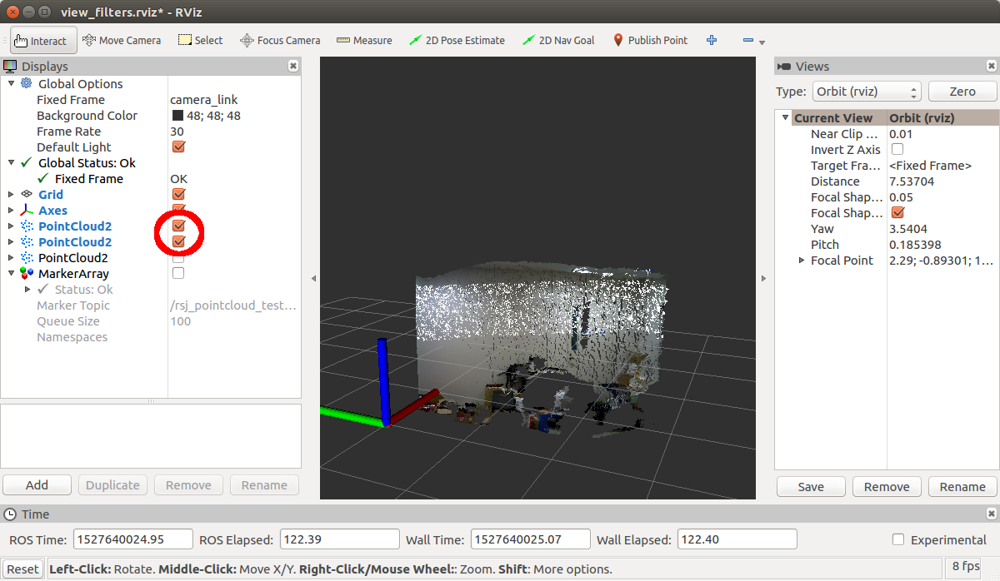
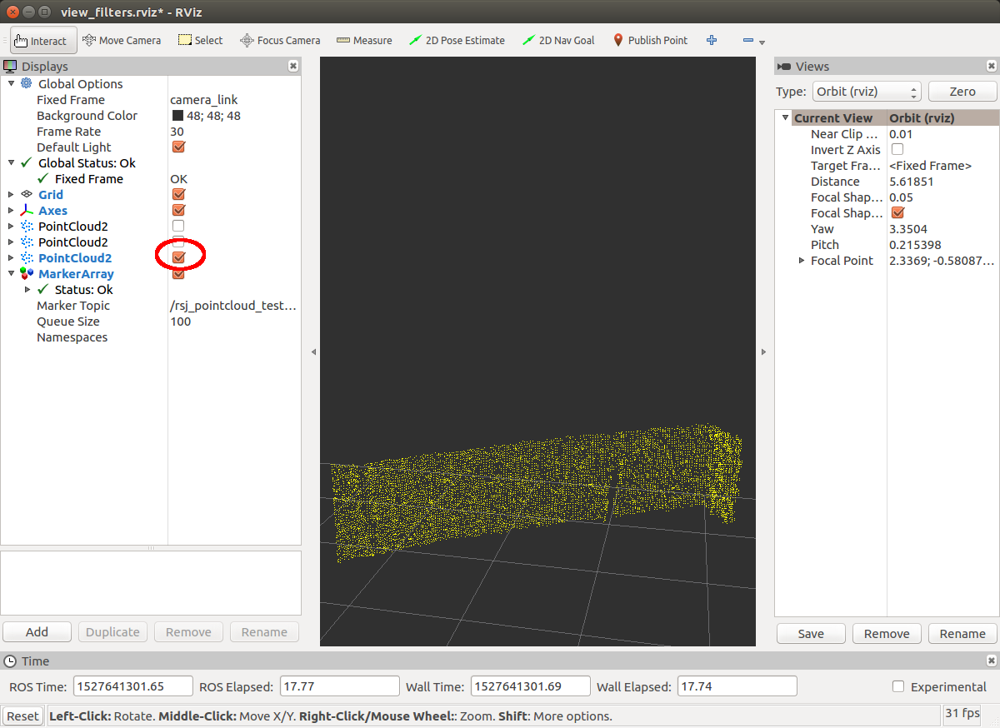
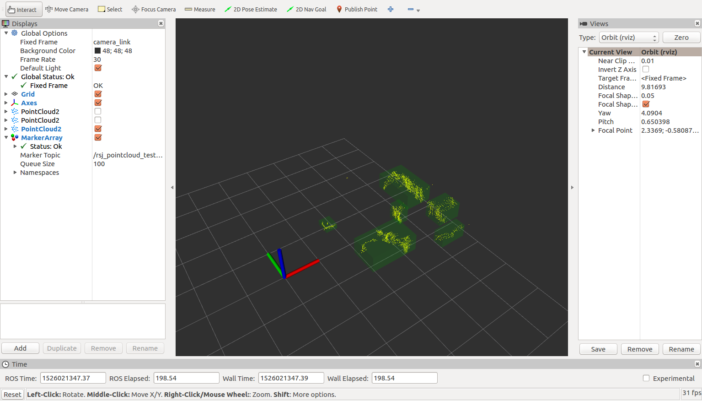
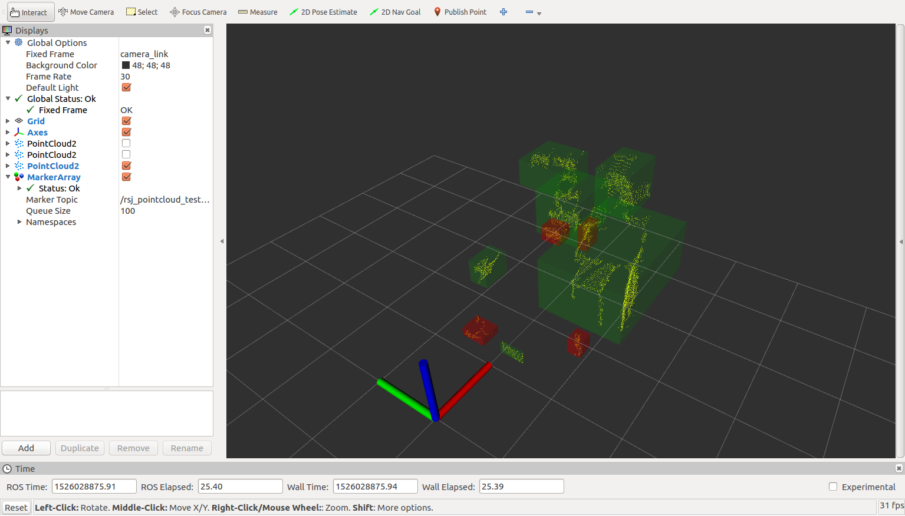
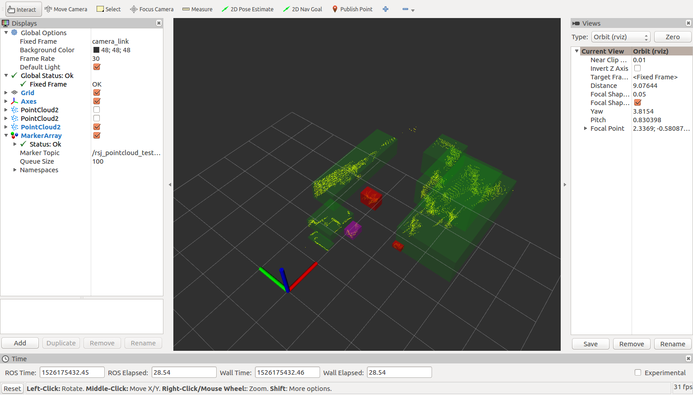

- Table of contents
{:toc}

３次元点群に対して様々なフィルタを施し、移動ロボットの追跡対象など意味のある情報を抽出します。

# PassThrough フィルタ

`PassThrough`フィルタは得られた点群のうち、一定の範囲内にある点群のみを抽出します。
テキストエディタで`rsj_pointcloud_test_node.cpp`を開いてください。

```shell
$ cd ~/catkin_ws/src/rsj_pointcloud_test/src
任意のテキストエディタで rsj_pointcloud_test_node.cpp を開く
```

プログラム冒頭に`include`文を追記してください。

```c++
#include <pcl/point_types.h>
#include <pcl/filters/passthrough.h>
#include <visualization_msgs/MarkerArray.h>
typedef pcl::PointXYZ PointT;
typedef pcl::PointCloud<PointT> PointCloud;
```

`rsj_pointcloud_test_node`クラスの冒頭に、`pcl::PassThrough`フィルタのインスタンスを追加します。
また、フィルタの結果を格納するための`PointCloud`型変数`cloud_passthrough`、および処理結果を`publish`するためのパブリッシャ`pub_passthrough`を追加します。

```c++
class rsj_pointcloud_test_node
{
private:
略
  PointCloud::Ptr cloud_tranform;
  pcl::PassThrough<PointT> pass;
  PointCloud::Ptr cloud_passthrough;
  ros::Publisher pub_passthrough;
```

`rsj_pointcloud_test_node`クラスのコンストラクタで`PassThrough`フィルタの設定、`cloud_passthrough`および`pub_passthrough`を初期化します。

```c++
  rsj_pointcloud_test_node()
  {
    略
    cloud_tranform.reset(new PointCloud());
    pass.setFilterFieldName("z"); // Z軸（高さ）の値でフィルタをかける
    pass.setFilterLimits(0.1, 1.0); // 0.1 〜 1.0 m の間にある点群を抽出
    cloud_passthrough.reset(new PointCloud());
    pub_passthrough = nh.advertise<PointCloud>("passthrough", 1);
  }
```

`cb_points`関数を次のように変更します。

```c++
  void cb_points(const PointCloud::ConstPtr &msg)
  {
    try{
      略
      // ここに cloud_src に対するフィルタ処理を書く
      pass.setInputCloud(cloud_src);
      pass.filter(*cloud_passthrough);
      pub_passthrough.publish(cloud_passthrough);
      ROS_INFO("points (src: %zu, paththrough: %zu)", cloud_src->size(), cloud_passthrough->size());
    }catch (std::exception &e){
      ROS_ERROR("%s", e.what());
    }
  }
```

## ビルド＆実行

まず、`catkin_ws`で`catkin_make`を実行して、追加したコードをビルドします。

```shell
$ cd ~/catkin_ws
$ catkin_make 
```

次にお手持ちの３次元センサごとに次のようにノードを起動します。

### Xtion PRO Live の場合

ターミナルでセンサを起動します。

```shell
$ cd ~/catkin_ws/
$ source devel/setup.bash
$ cd src/rsj_pointcloud_to_laserscan/launch
$ roslaunch rsj_pointcloud_to_laserscan.launch
```

新しいターミナルを開き、`rsj_pointcloud_test_node`を起動します。

```shell
$ rosrun  rsj_pointcloud_test rsj_pointcloud_test_node _target_frame:=camera_link _topic_name:=/camera/depth_registered/points
[ INFO] [1524040063.315596383]: target_frame='camera_link'
[ INFO] [1524040063.315656650]: topic_name='/camera/depth_registered/points'
[ INFO] [1524040063.320448185]: Hello Point Cloud!
[ INFO] [1524040064.148595331]: points (src: 307200, paththrough: 34350)
```

### YVT-35LX の場合

ターミナルでセンサを起動します。

```shell
？？？？
```

新しいターミナルを開き、`rsj_pointcloud_test_node`を起動します。

```shell
$ cd ~/catkin_ws/
$ source devel/setup.bash
$ rosrun rsj_pointcloud_test rsj_pointcloud_test_node _target_frame:= _topic_name:=/????????
```

実行した際に`points (src: xxxx, paththrough: xxx)`というメッセージが表示されれば成功です。
`src`、`paththrough`に続けて表示されている値はセンサから得られた、もとの`PointCloud`における点の個数と`PassThrough`フィルタ実行後の点の個数を示しています。
フィルタ実行後の点の個数がゼロの場合は`pass.setFilterLimits(0.5, 1.0);`の引数を調節してみてください。

## フィルタ実行結果の可視化

RViz でフィルタ実行後の点群の様子を可視化します。rsj_pointcloud_test_node を起動したまま、新しいターミナルを開き、 RViz を起動します。

```shell
$ cd ~/catkin_ws/src/rsj_pointcloud_test/config/rviz
$ rviz -d view_filters.rviz
```

最初は図のようにフィルタ実行前と実行後の点群が重なって表示されています。



RViz の左にある PointCloud2 の上の方のチェックを外すとフィルタ実行後の点群だけが表示されます。


# VoxelGrid フィルタ

３次元点群の処理には時間がかかることが多いため、低スペックの PC の場合はある程度点を間引いておいた方が都合が良いことがあります。
`VoxelGrid`フィルタは等間隔に点群をダウンサンプリングします。
引き続き`rsj_pointcloud_test_node.cpp`を編集します。
プログラム冒頭に`include`文を追記してください。

```c++
#include <pcl/filters/passthrough.h>
#include <pcl/filters/voxel_grid.h>
#include <visualization_msgs/MarkerArray.h>
typedef pcl::PointXYZ PointT;
```

`rsj_pointcloud_test_node`クラスの冒頭に、`pcl::VoxelGrid`フィルタのインスタンスを追加します。
また、フィルタの結果を格納するための`PointCloud`型変数`cloud_passthrough`、および処理結果を`publish`するためのパブリッシャ`pub_voxel`を追加します。

```c++
class rsj_pointcloud_test_node
{
private:
略
  ros::Publisher pub_passthrough;
  pcl::VoxelGrid<PointT> voxel;
  PointCloud::Ptr cloud_voxel;
  ros::Publisher pub_voxel;
```

`rsj_pointcloud_test_node`クラスのコンストラクタで`VoxelGrid`フィルタの設定、`cloud_voxel`および`pub_voxel`を初期化します。

```c++
  rsj_pointcloud_test_node()
  {
略
    pub_passthrough = nh.advertise<PointCloud>("passthrough", 1);
    voxel.setLeafSize (0.025f, 0.025f, 0.025f); // 0.025 m 間隔でダウンサンプリング
    cloud_voxel.reset(new PointCloud());
    pub_voxel = nh.advertise<PointCloud>("voxel", 1);
  }
```

`cb_points`関数を次のように変更します。

```c++
  void cb_points(const PointCloud::ConstPtr &msg)
  {
    try{
略
      pub_passthrough.publish(cloud_passthrough);
      voxel.setInputCloud(cloud_passthrough);
      voxel.filter(*cloud_voxel);
      pub_voxel.publish(cloud_voxel);
      ROS_INFO("points (src: %zu, paththrough: %zu, voxelgrid: %zu)", msg->size(), cloud_passthrough->size(), cloud_voxel->size());
    }catch (std::exception &e){
      ROS_ERROR("%s", e.what());
    }
  }
```

## ビルド＆実行

`PassThrough`フィルタのときと同様にビルドして実行してください。

## フィルタ実行結果の可視化

RViz でフィルタ実行後の点群の様子を可視化します。
`rsj_pointcloud_test_node`を起動したまま、新しいターミナルを開き、 RViz を起動します。

```shell
$ cd ~/catkin_ws/src/rsj_pointcloud_test/config/rviz
$ rviz -d view_filters.rviz
```

RViz の左にある`PointCloud2`の一番下のチェックだけをONにすると`VoxelGrid`フィルタ実行後の点群だけが表示されます。



`PassThrough`実行後の結果と比較すると点がまばらになっていることが分かると思います。
もし違いがわかりにくい場合は`setLeafSize`関数の引数を

```c++
  rsj_pointcloud_test_node()
  {
略
    voxel.setLeafSize (0.05f, 0.05f, 0.05f);// LeafSize 変更
```

のように大きくしてみてください（確認後は元の値に戻しておいてください）。

# クラスタリング

点群のクラスタリング（いくつかの塊に分離すること）により物体認識などをする際の物体領域候補が検出できます。
プログラム冒頭に`include`文を追記してください。

```c++
#include <pcl/filters/voxel_grid.h>
#include <pcl/common/common.h>
#include <pcl/kdtree/kdtree.h>
#include <pcl/segmentation/extract_clusters.h>
#include <visualization_msgs/MarkerArray.h>
typedef pcl::PointXYZ PointT;
```

`rsj_pointcloud_test_node`クラスの冒頭に、`pcl::search::KdTree`クラスのポインタ、`pcl::EuclideanClusterExtraction`クラスのインスタンス、検出されたクラスタの可視化情報をパブリッシュする `pub_cluster`を追加します。

```c++
class rsj_pointcloud_test_node
{
private:
略
  ros::Publisher pub_voxel;
  pcl::search::KdTree<PointT>::Ptr tree;
  pcl::EuclideanClusterExtraction<PointT> ec;
  ros::Publisher pub_clusters;
```

`rsj_pointcloud_test_node`クラスのコンストラクタで`pcl::EuclideanClusterExtraction`の設定、`tree`、`pub_clusters`の初期化をします。

```c++
  rsj_pointcloud_test_node()
  {
略
    pub_voxel = nh.advertise<PointCloud>("voxel", 1);
    tree.reset(new pcl::search::KdTree<PointT>());
    ec.setClusterTolerance(0.15);
    ec.setMinClusterSize(100);
    ec.setMaxClusterSize(5000);
    ec.setSearchMethod(tree);
    pub_clusters = nh.advertise<visualization_msgs::MarkerArray>("clusters", 1);
  }
```

`pcl::EuclideanClusterExtraction`の設定部分のプログラムは次のとおりです。

`ec.setClusterTolerance(0.15);`
: 15cm以上離れていれば別のクラスタだとみなす

`ec.setMinClusterSize(100); ec.setMaxClusterSize(5000);`
: クラスタを構成する点の数は最低でも100個、最高で5000個

`ec.setSearchMethod(tree);`
: ある点とクラスタを形成可能な点の探索方法としてKD木を使用する。

`cb_points`関数を次のように変更します。

```c++
  void cb_points(const PointCloud::ConstPtr &msg)
  {
    try
    {
        略
      pub_voxel.publish(cloud_voxel);
      std::vector<pcl::PointIndices> cluster_indices;
      tree->setInputCloud(cloud_voxel);
      ec.setInputCloud(cloud_voxel);
      ec.extract(cluster_indices);
      visualization_msgs::MarkerArray marker_array;
      int marker_id = 0;
      for (std::vector<pcl::PointIndices>::const_iterator it = cluster_indices.begin(), it_end = cluster_indices.end(); it != it_end; ++it, ++marker_id)
      {
        Eigen::Vector4f min_pt, max_pt;
        pcl::getMinMax3D(*cloud_voxel, *it, min_pt, max_pt);
        marker_array.markers.push_back(make_marker(frame_id, "cluster", marker_id, min_pt, max_pt, 0.0f, 1.0f, 0.0f, 0.2f));
      }
      if (marker_array.markers.empty() == false)
      {
        pub_clusters.publish(marker_array);
      }
      ROS_INFO("points (src: %zu, paththrough: %zu, voxelgrid: %zu, cluster: %zu)", msg->size(), cloud_passthrough->size(), cloud_voxel->size(), cluster_indices.size());
    }
    catch (std::exception &e)
    {
      ROS_ERROR("%s", e.what());
    }
  }
```

## ビルド＆実行

`VoxelGrid`フィルタのときと同様にビルドして実行してください。

## フィルタ実行結果の可視化

RViz でフィルタ実行後の点群の様子を可視化します。
`rsj_pointcloud_test_node`を起動したまま新しいターミナルを開き、 RViz を起動します。

```shell
$ cd ~/catkin_ws/src/rsj_pointcloud_test/config/rviz
$ rviz -d view_filters.rviz
```

RViz の左にある`PointCloud2`の一番下のチェックだけを ON にすると`VoxelGrid`フィルタ実行後の点群だけが表示されます。
さらにクラスタリング結果が半透明の緑の BOX で表示されているのが分かります。
これはプログラム中でクラスタリング結果を RViz が可視化可能な型である `visualization_msgs::MarkerArray`に変換してパブリッシュしているからです。



# 特定の条件に合致するクラスタを検出する

検出したクラスタのうち、一定の大きさをもつものだけを抽出するようにしましょう。
最終的にはゴミ箱や人間の足など、特定の大きさなど何らかの条件を満たすクラスタに向かって走行するように制御します。

`cb_points`関数を次のように変更します。
```c++
  void cb_points(const PointCloud::ConstPtr &msg)
  {
    try
    {
        略
      pub_voxel.publish(cloud_voxel);
      std::vector<pcl::PointIndices> cluster_indices;
      tree->setInputCloud(cloud_voxel);
      ec.setInputCloud(cloud_voxel);
      ec.extract(cluster_indices);
      visualization_msgs::MarkerArray marker_array;
      int marker_id = 0;
      size_t ok = 0;
      for (std::vector<pcl::PointIndices>::const_iterator it = cluster_indices.begin(), it_end = cluster_indices.end(); it != it_end; ++it, ++marker_id)
      {
        Eigen::Vector4f min_pt, max_pt;
        pcl::getMinMax3D(*cloud_voxel, *it, min_pt, max_pt);
        Eigen::Vector4f cluster_size = max_pt - min_pt;
        bool is_ok = true;
        if (cluster_size.x() < 0.05 || cluster_size.x() > 0.4)
        {
          is_ok = false;
        }
        else if (cluster_size.y() < 0.05 || cluster_size.y() > 0.6)
        {
          is_ok = false;
        }
        else if (cluster_size.z() < 0.05 || cluster_size.z() > 0.5)
        {
          is_ok = false;
        }
        visualization_msgs::Marker marker = make_marker(frame_id, "cluster", marker_id, min_pt, max_pt, 0.0f, 1.0f, 0.0f, 0.2f);
        if (is_ok)
        {
          marker.ns = "ok_cluster";
          marker.color.r = 1.0f;
          marker.color.g = 0.0f;
          marker.color.b = 0.0f;
          marker.color.a = 0.5f;
          ok++;
        }
        marker_array.markers.push_back(marker);
      }
      if (marker_array.markers.empty() == false)
      {
        pub_clusters.publish(marker_array);
      }
      ROS_INFO("points (src: %zu, paththrough: %zu, voxelgrid: %zu, cluster: %zu, ok_cluster: %zu)", msg->size(), cloud_passthrough->size(), cloud_voxel->size(), cluster_indices.size(), ok);
    }
    catch (std::exception &e)
    {
      ROS_ERROR("%s", e.what());
    }
  }
```

## ビルド＆実行

クラスタリングのときと同様にビルドして実行してください。

## フィルタ実行結果の可視化

クラスタリングのときと同様に RViz で可視化してください。ある一定の大きさのクラスタだけを赤く表示しているのが分かります。



# 最も近いクラスタを検出する

前項で抽出したクラスタのうち、センサに最も近いクラスタを選択するようにしましょう。

`cb_points`関数を次のように変更します。
```c++
  void cb_points(const PointCloud::ConstPtr &msg)
  {
    try
    {
        略
      pub_voxel.publish(cloud_voxel);
      std::vector<pcl::PointIndices> cluster_indices;
      tree->setInputCloud(cloud_voxel);
      ec.setInputCloud(cloud_voxel);
      ec.extract(cluster_indices);
      visualization_msgs::MarkerArray marker_array;
      int target_index = -1; // 追加
      int marker_id = 0;
      size_t ok = 0;
      for (std::vector<pcl::PointIndices>::const_iterator it = cluster_indices.begin(), it_end = cluster_indices.end(); it != it_end; ++it, ++marker_id)
      {
          略
        if (is_ok)
        {
          marker.ns = "ok_cluster";
          marker.color.r = 1.0f;
          marker.color.g = 0.0f;
          marker.color.b = 0.0f;
          marker.color.a = 0.5f;
          ok++;
          if(target_index < 0){
            target_index = marker_array.markers.size();
          }else{
            float d1 = ::hypot(marker_array.markers[target_index].pose.position.x, marker_array.markers[target_index].pose.position.y);
            float d2 = ::hypot(marker.pose.position.x, marker.pose.position.y);
            if(d2 < d1){
              target_index = marker_array.markers.size();
            }
          }
        }
        marker_array.markers.push_back(marker);
      }
      if (marker_array.markers.empty() == false)
      {
        if(target_index >= 0){
          marker_array.markers[target_index].ns = "target_cluster";
          marker_array.markers[target_index].color.r = 1.0f;
          marker_array.markers[target_index].color.g = 0.0f;
          marker_array.markers[target_index].color.b = 1.0f;
          marker_array.markers[target_index].color.a = 0.5f;
        }
        pub_clusters.publish(marker_array);
      }
      ROS_INFO("points (src: %zu, paththrough: %zu, voxelgrid: %zu, cluster: %zu, ok_cluster: %zu)", msg->size(), cloud_passthrough->size(), cloud_voxel->size(), cluster_indices.size(), ok);
    }
    catch (std::exception &e)
    {
      ROS_ERROR("%s", e.what());
    }
  }
```

## ビルド＆実行

前項と同様にビルドして実行してください。

## フィルタ実行結果の可視化

前項と同様に RViz で可視化してください。ある一定の大きさのクラスタだけを赤く表示し、その中でセンサに最も近いクラスタを紫で表示しているのが分かります。


