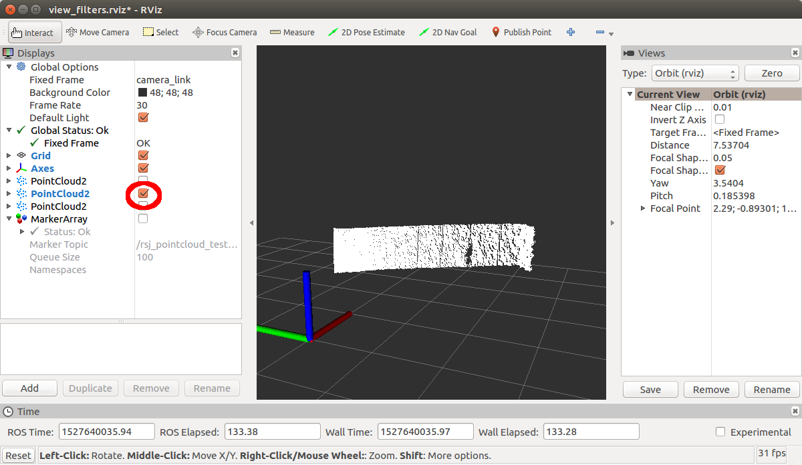

# PointCloud に対するフィルタ

３次元点群に対して様々なフィルタを施し、移動ロボットの追跡対象など意味のある情報を抽出します。

## PassThrough フィルタ

PassThrough フィルタは得られた点群のうち、一定の範囲内にある点群のみを抽出します。
テキストエディタで rsj_pointcloud_test_node.cpp を開いてください。

```shell
$ cd catkin_ws/src/rsj_pointcloud_test/src
任意のテキストエディタで rsj_pointcloud_test_node.cpp を開く
```

プログラム冒頭に include 文を追記してください。

```c++
#include <pcl/point_types.h>
#include <pcl/filters/passthrough.h>
typedef pcl::PointXYZ PointT;
typedef pcl::PointCloud<PointT> PointCloud;
```

rsj_pointcloud_test_node クラスの冒頭に、pcl::PassThrough フィルタのインスタンスを追加します。
また、フィルタの結果を格納するための PointCloud 型変数 cloud_passthrough 、および処理結果を publish するためのパブリッシャ 、pub_passthrough を追加します。

```c++
class rsj_pointcloud_test_node
{
private:
  ros::Subscriber sub_points;
  pcl::PassThrough<PointT> pass;
  pcl::PointCloud<PointT>::Ptr cloud_passthrough;
  ros::Publisher pub_passthrough;
```
rsj_pointcloud_test_node クラスのコンストラクタで passthrough フィルタの設定、 cloud_passthrough および pub_passthrough を初期化します。

```c++
  rsj_pointcloud_test_node()
  {
    ros::NodeHandle nh("~");
    sub_points = nh.subscribe("/camera/depth_registered/points", 5, &rsj_pointcloud_test_node::cb_points, this);
    pass.setFilterFieldName("y");
    pass.setFilterLimits(-1.0, -0.5);
    cloud_passthrough.reset(new PointCloud());
    pub_passthrough = nh.advertise<PointCloud>("passthrough", 1);
  }
```

cb_points 関数を次のように変更します。

```c++
  void cb_points(const PointCloud::ConstPtr &msg)
  {
    try{
        pass.setInputCloud(msg);
        pass.filter(*cloud_passthrough);
        pub_passthrough.publish(cloud_passthrough);
        ROS_INFO("points (src: %zu, paththrough: %zu)", msg->size(), cloud_passthrough->size()); 
    }catch (std::exception &e){
      ROS_ERROR("%s", e.what());
    }
  }
```

## ビルド＆実行

まず、catkin_wsでcatkin_makeを実行して、追加したコードをビルドします。
```shell
$ cd ~/catkin_ws
$ catkin_make 
```

次にお手持ちの３次元センサを起動します。

### Xtion PRO Live の場合

```shell
$ cd ~/catkin_ws/src/rsj_pointcloud_to_laserscan/launch
$ roslaunch rsj_pointcloud_to_laserscan.launch
```

### YVT-35LX の場合

？？？？

新しいターミナルを開き、 rsj_pointcloud_test_node を起動します。

```shell
$ rosrun rsj_pointcloud_test rsj_pointcloud_test_node
[ INFO] [1523936864.252130797]: Hello Point Cloud!
[ INFO] [1523936865.030358434]: points (src: 307200, paththrough: 1454)
```

このように「points (src: xxxx, paththrough: xxx)」というメッセージが表示されれば成功です。
src, paththrough に続けて表示されている値はセンサから得られたもとの PointCloud における点の個数と passthrough フィルタ実行後の点の個数を示しています。paththrough フィルタ実行後の点の個数がゼロの場合は pass.setFilterLimits(-1.0, -0.5); の引数を調節してみてください。

!!!PCLとROSの座標系の違い!!!

## フィルタ実行結果の可視化

rviz でフィルタ実行後の点群の様子を可視化します。rsj_pointcloud_test_node を起動したまま、新しいターミナルを開き、 rviz を起動します。

```shell
$ cd ~/catkin_ws/src/rsj_pointcloud_test/config/rviz
$ rviz -d view_filters.rviz
```

最初は図のようにフィルタ実行前と実行後の点群が重なって表示されています。


rviz の左にある PointCloud2 の上の方のチェックを外すとフィルタ実行後の点群だけが表示されます。



# VoxelGrid フィルタ

３次元点群の処理には時間がかかることが多いため、低スペックのPCの場合はある程度点を間引いておいた方が都合が良いことがあります。
VoxelGrid フィルタは等間隔に点群をダウンサンプリングします。
引き続き rsj_pointcloud_test_node.cpp を編集します。
プログラム冒頭に include 文を追記してください。

```c++
#include <pcl/filters/passthrough.h>
#include <pcl/filters/voxel_grid.h>
typedef pcl::PointXYZ PointT;
```

rsj_pointcloud_test_node クラスの冒頭に、pcl::PassThrough フィルタのインスタンスを追加します。
また、フィルタの結果を格納するための PointCloud 型変数 cloud_passthrough 、および処理結果を publish するためのパブリッシャ 、pub_passthrough を追加します。

```c++
class rsj_pointcloud_test_node
{
private:
略
  ros::Publisher pub_passthrough;
  pcl::VoxelGrid<PointT> voxel;
  pcl::PointCloud<PointT>::Ptr cloud_voxel;
  ros::Publisher pub_voxel;
```
rsj_pointcloud_test_node クラスのコンストラクタで voxelgrid フィルタの設定、 cloud_voxel および pub_voxel を初期化します。

```c++
  rsj_pointcloud_test_node()
  {
略
    pub_passthrough = nh.advertise<PointCloud>("passthrough", 1);
    voxel.setLeafSize (0.025f, 0.025f, 0.025f);
    cloud_voxel.reset(new PointCloud());
    pub_voxel = nh.advertise<PointCloud>("voxel", 1);
  }
```

cb_points 関数を次のように変更します。

```c++
  void cb_points(const PointCloud::ConstPtr &msg)
  {
    try{
略
        pub_passthrough.publish(cloud_passthrough);
        voxel.setInputCloud(cloud_passthrough);
        voxel.filter(*cloud_voxel);
        pub_voxel.publish(cloud_voxel);
        ROS_INFO("points (src: %zu, paththrough: %zu, voxelgrid: %zu)", msg->size(), cloud_passthrough->size(), cloud_voxel->size());
    }catch (std::exception &e){
      ROS_ERROR("%s", e.what());
    }
  }
```

## ビルド＆実行
passthrough フィルタのときと同様にビルドして実行してください。

## フィルタ実行結果の可視化

rviz でフィルタ実行後の点群の様子を可視化します。rsj_pointcloud_test_node を起動したまま、新しいターミナルを開き、 rviz を起動します。

```shell
$ cd ~/catkin_ws/src/rsj_pointcloud_test/config/rviz
$ rviz -d view_filters.rviz
```

rviz の左にある PointCloud2 の一番下のチェックだけをONにすると VoxelGrid フィルタ実行後の点群だけが表示されます。


PassThrough 実行後の結果と比較すると点がまばらになっていることが分かると思います。もし違いがわかりにくい場合は次のように setLeafSize 関数の引数を大きくしてみてください（確認後は元の値に戻しておいてください）。

```c++
  rsj_pointcloud_test_node()
  {
略
    pub_passthrough = nh.advertise<PointCloud>("passthrough", 1);
    voxel.setLeafSize (0.05f, 0.05f, 0.05f);// LeafSize 変更
    cloud_voxel.reset(new PointCloud());
    pub_voxel = nh.advertise<PointCloud>("voxel", 1);
  }
```

## クラスタリング

点群のクラスタリング（いくつかの塊に分離すること）により物体認識などをする際の物体領域候補が検出できます。
プログラム冒頭に include 文を追記してください。

```c++
#include <pcl/filters/voxel_grid.h>
#include <pcl/common/common.h>
#include <pcl/kdtree/kdtree.h>
#include <pcl/segmentation/extract_clusters.h>
#include <visualization_msgs/MarkerArray.h>
typedef pcl::PointXYZ PointT;
```

ここで #include <visualization_msgs/Marker.h> はクラスタリング結果をrvizで可視化するために必要なヘッダファイルです。

rsj_pointcloud_test_node クラスの冒頭に、pcl::search::KdTree クラスのポインタ、 pcl::EuclideanClusterExtraction クラスのインスタンス、検出されたクラスタの可視化情報をパブリッシュする pub_cluster を追加します。

```c++
class rsj_pointcloud_test_node
{
private:
略
  ros::Publisher pub_voxel;
  pcl::search::KdTree<PointT>::Ptr tree;
  pcl::EuclideanClusterExtraction<PointT> ec;
  ros::Publisher pub_clusters;
```

rsj_pointcloud_test_node クラスのコンストラクタで pcl::EuclideanClusterExtraction の設定、 tree 、 pub_clusters の初期化をします。

```c++
  rsj_pointcloud_test_node()
  {
略
    pub_voxel = nh.advertise<PointCloud>("voxel", 1);
    tree.reset(new pcl::search::KdTree<PointT>());
    ec.setClusterTolerance(0.15);
    ec.setMinClusterSize(100);
    ec.setMaxClusterSize(5000);
    ec.setSearchMethod(tree);
    pub_clusters = nh.advertise<visualization_msgs::MarkerArray>("clusters", 1);
  }
```

pcl::EuclideanClusterExtraction の設定部分のプログラムは次のとおりです。

ec.setClusterTolerance(0.15);…15cm以上離れていれば別のクラスタだとみなす

ec.setMinClusterSize(100); ec.setMaxClusterSize(5000); …クラスタを構成する点の数は最低でも100個、最高で5000個

ec.setSearchMethod(tree);…ある点とクラスタを形成可能な点の探索方法としてKD木を使用する。

cb_points 関数を次のように変更します。

```c++
  void cb_points(const PointCloud::ConstPtr &msg)
  {
    try
    {
        略
      pub_voxel.publish(cloud_voxel);
      std::vector<pcl::PointIndices> cluster_indices;
      tree->setInputCloud(cloud_voxel);
      ec.setInputCloud(cloud_voxel);
      ec.extract(cluster_indices);
      visualization_msgs::MarkerArray marker_array;
      int marker_id = 0;
      for (std::vector<pcl::PointIndices>::const_iterator it = cluster_indices.begin(), it_end = cluster_indices.end(); it != it_end; ++it, ++marker_id)
      {
        Eigen::Vector4f min_pt, max_pt;
        pcl::getMinMax3D(*cloud_voxel, *it, min_pt, max_pt);
        marker_array.markers.push_back(make_marker(msg->header.frame_id, marker_id, min_pt, max_pt));
      }
      if (marker_array.markers.empty() == false)
      {
        pub_clusters.publish(marker_array);
      }
      ROS_INFO("points (src: %zu, paththrough: %zu, voxelgrid: %zu, cluster: %zu)", msg->size(), cloud_passthrough->size(), cloud_voxel->size(), cluster_indices.size());
    }
    catch (std::exception &e)
    {
      ROS_ERROR("%s", e.what());
    }
  }
```

## ビルド＆実行
VoxelGrid フィルタのときと同様にビルドして実行してください。

## フィルタ実行結果の可視化

rviz でフィルタ実行後の点群の様子を可視化します。rsj_pointcloud_test_node を起動したまま、新しいターミナルを開き、 rviz を起動します。

```shell
$ cd ~/catkin_ws/src/rsj_pointcloud_test/config/rviz
$ rviz -d view_filters.rviz
```

rviz の左にある PointCloud2 の一番下のチェックだけをONにすると VoxelGrid フィルタ実行後の点群だけが表示されます。
さらにクラスタリング結果が半透明の緑のBOXで表示されているのが分かります。