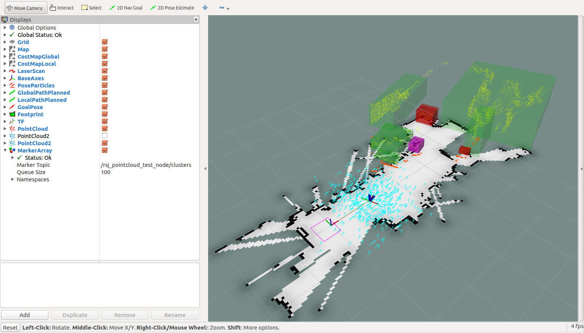

- Table of contents
{:toc}

PCL のクラスタリング結果を`rsj_robot_test_node`で利用してみましょう。

# rsj_robot_test.cpp の編集

テキストエディタで`rsj_robot_test.cpp`を開いてください。

```shell
$ cd ~/catkin_ws/src/rsj_robot_test/src
任意のテキストエディタで rsj_robot_test.cpp を開く
```

先頭に`visualization_msgs::MarkerArray`を扱うための`include`文を加えます。

```c++
#include <tf/transform_datatypes.h>
#include <visualization_msgs/MarkerArray.h> // 追記
```

`CMakeLists.txt`を編集します。

```shell
$ cd ~/catkin_ws/src/rsj_robot_test
任意のテキストエディタで CMakeLists.txt を開く
```

`find_package`と`catkin_package`の最後に`visualization_msgs`を追記します。

```cmake
find_package(catkin REQUIRED COMPONENTS
  (略)
  tf
  visualization_msgs  # 追記
)
find_package(Boost 1.53 REQUIRED system serialization)

## Declare a catkin package
catkin_package(DEPENDS
  (略)
  tf
  visualization_msgs  # 追記
)
```

また、package.xml の`<build_depend>` `<run_depend>` にも`visualization_msgs`を追記します。

```xml
  (略)
  <build_depend>tf</build_depend>
  <build_depend>visualization_msgs</build_depend> <!--追記-->

  (略)
  <run_depend>tf</run_depend>
  <run_depend>visualization_msgs</run_depend> <!--追記-->
```

一旦ビルドし、コンパイルエラーがないことを確認してください。

```shell
$ cd ~/catkin_ws
$ catkin_make
```

# クラスタリング結果の受信

`RsjRobotTestNode`クラスで、`sub_odom_`や`sub_scan_`を定義しているところに、`visualization_msgs::MarkerArray`用のサブスクライバを追加します。

```c++
ros::Subscriber sub_scan_;
ros::Subscriber sub_clusters_; // 追記
```

`RsjRobotTestNode`のコンストラクタに、`visualization_msgs::MarkerArray`用のサブスクライバ初期化コードを追加します。

```c++
RsjRobotTestNode()
{
略
  sub_scan_ = nh_.subscribe("scan", 5, &RsjRobotTestNode::cbScan, this);
  sub_clusters_ = nh_.subscribe("rsj_pointcloud_test_node/clusters", 5, &RsjRobotTestNode::cbCluster, this); // 追記
```

更に、`RsjRobotTestNode`クラスに、`visualization_msgs::MarkerArray`用のコールバック関数を追加します。(`cbScan`の後の位置など)

```c++
void cbCluster(const visualization_msgs::MarkerArray::ConstPtr &msg)
{
  ROS_INFO("clusters: %zu", msg->markers.size());
}
```

編集が終了したらエディタを閉じてください。

# ビルド＆実行

ターミナルで次のコマンドを実行してください。

```
$ cd ~/catkin_ws
$ catkin_make
```

お手持ちの 3D センサ、およびロボットの USB ケーブルをPCに接続しておきます。

また、ロボットが走り出さないように、電池ボックスのスイッチを OFF にしておいてください。

まずナビゲーションシステムを起動します。
地図を作成した際の初期位置・姿勢と同じようにロボットを置いて、下記のコマンドを実行します。

## Xtion PRO Live の場合

```shell
$ cd ~/catkin_ws/
$ source devel/setup.bash
$ roslaunch rsj_seminar_navigation xtion_integration.launch \
robot_param:=/home/【ユーザ名】/params/rsj-seminar20??.param 【該当するものに置き換えること】
```

## YVT-35LX の場合
```shell
$ cd ~/catkin_ws/
$ source devel/setup.bash
$ roslaunch rsj_seminar_navigation 3durg_integration.launch \
robot_param:=/home/【ユーザ名】/params/rsj-seminar20??.param 【該当するものに置き換えること】
```

# rsj_pointcloud_test_node と rsj_robot_test_node の起動

3次元センサをお持ちの場合は新しいターミナルを開き`rsj_pointcloud_test_node`を起動します。

## Xtion PRO Live の場合

```shell
$ rosrun  rsj_pointcloud_test rsj_pointcloud_test_node \
_target_frame:=camera_link _topic_name:=/camera/depth_registered/points
[ INFO] [1524040063.315596383]: target_frame='camera_link'
[ INFO] [1524040063.315656650]: topic_name='/camera/depth_registered/points'
[ INFO] [1524040063.320448185]: Hello Point Cloud!
[ INFO] [1524040064.148595331]: points (src: 307200, paththrough: 34350)
```

## YVT-35LX の場合

```shell
$ cd ~/catkin_ws/
$ source devel/setup.bash
$ rosrun rsj_pointcloud_test rsj_pointcloud_test_node \
_target_frame:= _topic_name:=/hokuyo3d/hokuyo_cloud2
[ INFO] [1528008816.751100536]: points (src: 2674, paththrough: 1019)
```

さらに別のターミナルで`rsj_robot_test_node`を起動します。

```shell
$ rosrun  rsj_robot_test rsj_robot_test_node 
[ INFO] [1523957582.691740639]: Hello ROS World!
[ INFO] [1523957582.991946984]: clusters: 6
[ INFO] [1523957583.091959056]: clusters: 7
[ INFO] [1523957583.191939063]: front-range: 3.178
[ INFO] [1523957583.192001041]: front-range: 3.178
```

`rsj_robot_test_node`側で「`[ INFO] [1523957583.091959056]: clusters: 7`」のように PCL で処理したクラスタを受信し、その個数を表示できていることが分かります。
また RViz 上では`navigation`用のマップ上に重畳して`PointCloud`のクラスタと、クラスタを囲む直方体が表示されています。センサに最も近いクラスタは紫で表示されています。



# センサに最も近いクラスタの位置情報を取得する

RViz 上で紫で表示されている、センサに最も近いクラスタの位置を取得しましょう。

テキストエディタで`rsj_robot_test.cpp`を開いてください。

```shell
$ cd ~/catkin_ws/src/rsj_robot_test/src
任意のテキストエディタで rsj_robot_test.cpp を開く
```

`cbCluster`関数を編集します。

```c++
void cbCluster(const visualization_msgs::MarkerArray::ConstPtr &msg)
{
  const visualization_msgs::Marker *target = NULL;
  for (visualization_msgs::MarkerArray::_markers_type::const_iterator it = msg->markers.cbegin(), it_end = msg->markers.cend();
       it != it_end; ++it)
  {
    const visualization_msgs::Marker &marker = *it;
    if (marker.ns == "target_cluster")
    {
      target = &marker;
    }
  }
  ROS_INFO("clusters: %zu", msg->markers.size());
  if (target != NULL)
  {
    float dx = target->pose.position.x;
    float dy = target->pose.position.y;
    ROS_INFO("target: %f, %f", dx, dy);
  }
}
```

編集が終了したらエディタを閉じてください。

# ビルド＆実行

前項と同じようにビルドして実行してください。
`rsj_robot_test_node`側で「`[ INFO] [1526342853.141823400]: target: 2.579500, 0.063012`」のように PCL で処理した最も近いクラスタの座標がを表示できていることが分かります。なおここで表示されている座標はロボットの中心を原点とし、正面をX軸プラス方向とするローカル座標系です。

終了したら[課題](lesson.html)に進んでください。
