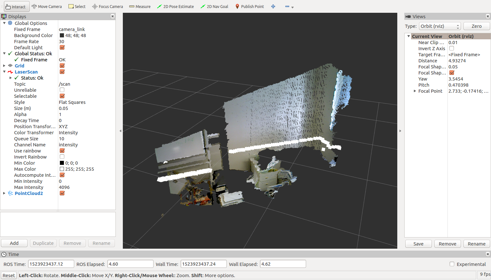

- Table of contents
{:toc}

Xtion PRO Live や YVT-35LX から得られる３次元点群`PointCloud`に対する基本的な処理を実習します。

# Point Cloud の表示

各センサから得られる点群を RViz によって可視化します。センサごとに実行するコマンドが異なりますので、お手持ちのセンサに応じて次のコマンドを実行してください。

## Xtion PRO Live の場合

```shell
$ cd ~/catkin_ws/
$ source devel/setup.bash
$ cd src/rsj_pointcloud_to_laserscan/launch
$ roslaunch rsj_pointcloud_to_laserscan.launch
```

別のターミナルを開き

```shell
$ cd ~/catkin_ws/src/rsj_pointcloud_to_laserscan/config/rviz
$ rosrun rviz rviz -d view_points.rviz
```

図のように`PointCloud`が表示されれば成功です。



起動した２つのターミナルを __Ctrl+c__{: style="border: 1px solid black" } で終了してください。

## YVT-35LX の場合

？？？？

# PCL（Point Cloud Library）による３次元点群処理

ロボットでオドメトリのデータを利用したときと同じように３次元センサが出力した`PointCloud`のデータを受け取るプログラムを作成しましょう。
`PointCloud`の処理を独自に書こうとすると大変な労力が必要です。
２次元画像処理用に[OpenCV](https://opencv.org/)というライブラリがあるように、３次元点群処理には[PCL(Point Cloud Library)](http://pointclouds.org/) があります。
PCL を利用するプログラムを作成してみましょう。

端末を開き雛形をダウンロードしてください。

```shell
$ cd ~/catkin_ws/src
$ git clone https://github.com/KMiyawaki/rsj_pointcloud_test.git
```

テキストエディタで`rsj_pointcloud_test_node.cpp`を開いてください。

```shell
$ cd ~/catkin_ws/src/rsj_pointcloud_test/src
任意のテキストエディタで rsj_pointcloud_test_node.cpp を開く
```

`rsj_pointcloud_test_node`クラスにある、`PointCloud`用のコールバック関数`cb_points`を編集します。

```c++
  void cb_points(const PointCloud::ConstPtr &msg)
  {
    try
    {
      略
      // ここに cloud_src に対するフィルタ処理を書く
      ROS_INFO("width: %zu, height: %zu", cloud_src->width, cloud_src->height);
    }
    catch (std::exception &e)
    {
      ROS_ERROR("%s", e.what());
    }
  }
```

ファイルを保存してエディタを閉じます。

# ビルド＆実行

まず、`catkin_ws`で`catkin_make`を実行して、追加したコードをビルドします。

```shell
$ cd ~/catkin_ws
$ catkin_make 
```

次にお手持ちの３次元センサごとに次のようにノードを起動します。

## Xtion PRO Live の場合

ターミナルでセンサを起動します。

```shell
$ cd ~/catkin_ws/
$ source devel/setup.bash
$ cd src/rsj_pointcloud_to_laserscan/launch
$ roslaunch rsj_pointcloud_to_laserscan.launch
```

新しいターミナルを開き、`rsj_pointcloud_test_node`を起動します。

```shell
$ rosrun  rsj_pointcloud_test rsj_pointcloud_test_node _target_frame:=camera_link _topic_name:=/camera/depth_registered/points
[ INFO] [1524039160.481736901]: target_frame='camera_link'
[ INFO] [1524039160.481783905]: topic_name='/camera/depth_registered/points'
[ INFO] [1524039160.485222004]: Hello Point Cloud!
[ INFO] [1524039161.311438819]: width: 640, height: 480
```

## YVT-35LX の場合

ターミナルでセンサを起動します。

```shell
？？？？
```

新しいターミナルを開き、`rsj_pointcloud_test_node`を起動します。

```shell
$ cd ~/catkin_ws/
$ source devel/setup.bash
$ rosrun rsj_pointcloud_test rsj_pointcloud_test_node _target_frame:= _topic_name:=/????????
```

このように`width: xxx, height: xxx`というメッセージが表示されれば`PointCloud`は受信できています。
width, height とは３次元点群の縦・横の点の数を示しています（２次元画像の解像度に対応しています）。

# 補足 rsj_pointcloud_test_node.cpp について

プログラムの先頭には ROS 内で PCL を扱うためのヘッダファイルに関する`include`文と実習で使う`PointCloud`の型宣言が記述されています。

```c++
#include <pcl_ros/point_cloud.h>
#include <pcl/point_types.h>
#include <visualization_msgs/MarkerArray.h>
typedef pcl::PointXYZ PointT
typedef pcl::PointCloud<PointT> PointCloud;
```

最終行の`typedef`宣言では今回の実習で利用する点群の型を生成しています。
PCL では`pcl::PointCloud<T>`という C++ のテンプレートで点群を扱うデータ型を表現しています。
`T`の部分には座標と色情報を持つ`pcl::PointXYZRGB`など様々な点の型を与えることが可能です。
今回は色情報のない、位置だけの点`pcl::PointXYZ`を使います。

なお、`#include <visualization_msgs/MarkerArray.h>`は点群処理結果を可視化するために必要となる ROS に含まれるヘッダファイルです。

`rsj_pointcloud_test_node`クラスの冒頭には、`sub_odom`と同じように`PointCloud`用のサブスクライバクラスを宣言しています。

```c++
class rsj_pointcloud_test_node 
{
private:
  ros::Subscriber sub_points;
```

`rsj_pointcloud_test_node`のコンストラクタには、このノードが必要としているパラメータの取得や`PointCloud`用のサブスクライバ初期化コードが記述されています。

```c++
rsj_pointcloud_test_node()
{ 
  ros::NodeHandle nh("~");
  target_frame = "";
  std::string topic_name = "/camera/depth_registered/points";
  nh.getParam("target_frame", target_frame);
  nh.getParam("topic_name", topic_name);
  ROS_INFO("target_frame='%s'", target_frame.c_str());
  ROS_INFO("topic_name='%s'", topic_name.c_str());
  sub_points = nh.subscribe(topic_name, 5, &rsj_pointcloud_test_node::cb_points, this);
```

`topic_name`はセンサが出力する`PointCloud`のトピック名を、`target_frame`は得られた点群を処理しやすい座標系に変換する際の座標系の名前を示しています。
特に Xtion PRO Live の場合、点群の座標系はロボットのローカル座標系と異なっているため、`cb_points`関数の冒頭で座標変換をしています。
`target_frame`が空白の場合は座標変換を行いません（YVT-35LX の場合）。

`CMakeLists.txt`では PCL を ROS で扱えるようにしています。

```c++
find_package(catkin REQUIRED COMPONENTS roscpp std_msgs nav_msgs geometry_msgs sensor_msgs tf pcl_ros)
(注：最後に pcl_ros を追加している)
```

終了したら PCL を使った点群処理に関する実習に進んでください。

[PointCloud に対するフィルタ](ros_3d_points_filters.html)
