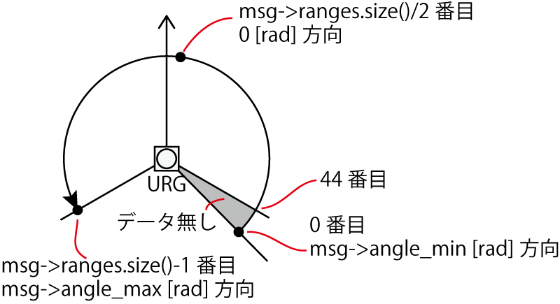
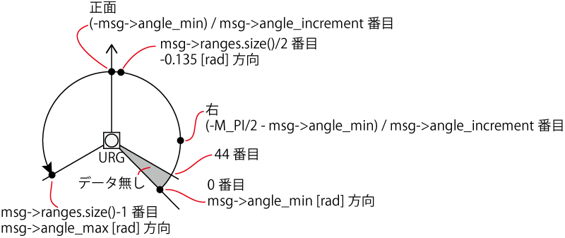

# ROSを用いた点群取得

- Table of contents
{:toc}

ここではURG-04LX-UG01の場合を例に、点群を取得してロボットの動作に反映する方法を習得します。

## urg_nodeをインストール

```shell
$ sudo apt-get update
$ sudo apt-get install ros-kinetic-urg-node
```

## rsj_robot_test_nodeでURGのデータ取得
### ソースコードの変更
ソースコードの先頭部分で、スキャンデータのメッセージ型をincludeします。

```c++
(略)
#include <geometry_msgs/Twist.h>
#include <sensor_msgs/LaserScan.h>  // <- スキャンデータのメッセージ型をinclude
```

RsjRobotTestNodeクラス内で、sub_odom_(サブスクライバクラス)を定義しているところに、
URG用のサブスクライバクラスを追加します。

```c++
class RsjRobotTestNode
{
private:
	(略)
	ros::Subscriber sub_odom_;
	ros::Subscriber sub_scan_;  // <- URG用のサブスクライバクラスを追加
```

RsjRobotTestNodeのコンストラクタに、
URG用のサブスクライバ初期化コードを追加します。

```c++
RsjRobotTestNode()
  : nh_()
{
  pub_twist_ = nh_.advertise<geometry_msgs::Twist>(
      "cmd_vel", 5);
  sub_odom_ = nh_.subscribe(
      "odom", 5, &RsjRobotTestNode::cbOdom, this);
	sub_scan_ = nh_.subscribe(
      "scan", 5, &rsj_robot_test_node::cbScan, this);  // <- URG用のサブスクライバ初期化コードを追加
```

更に、RsjRobotTestNodeクラスに、
URG用のコールバック関数を追加します。(cbOdomの後の位置など)

```c++
void cbScan(const sensor_msgs::LaserScan::ConstPtr &msg)
{
	int i = msg->ranges.size() / 2;
	if(msg->ranges[i] < msg->range_min ||  // エラー値の場合
		msg->ranges[i] > msg->range_max ||  // 測定範囲外の場合
		std::isnan(msg->ranges[i]))  // 無限遠の場合
	{
		ROS_INFO("front-range: measurement error");
	}
	else
	{
		ROS_INFO("front-range: %0.3f",
			msg->ranges[msg->ranges.size() / 2]);
	}
}
```

このコールバック関数中では、距離データ配列のうち、
配列の中央の距離を表示しています。
すなわち、URGの場合、正面方向の距離データ(m単位)が表示されます。
また、msg->rangesの値がmsg->range_minより小さい場合は、測定エラー(遠すぎて測定できない、など)を意味しています。
なお、msg->ranges[0]はmsg->angle_min方向(rad単位)、msg->ranges[msg->size()-1]はmsg->angle_max方向(rad単位)を表します。



### ビルド＆実行

まず、catkin_wsでcatkin_makeを実行して、追加したコードをビルドします。
roscore、ypspur_ros、urg_node、rsj_robot_test_nodeを実行したいので、端末を4つ用意して、下記それぞれを実行します。

URGとロボットのUSBケーブルを接続しておきます。
また、ロボットが走り出さないように、電池ボックスのスイッチをOFFにしておくとよいでしょう。

1つ目の端末でroscoreを起動

```shell
$ roscore
```

2つ目の端末でypspur_rosを起動

```shell
$ rosrun ypspur_ros ypspur_ros _param_file:=/home/【ユーザ名】/params/rsj-seminar20??.param \
_port:=/dev/serial/by-id/usb-T-frog_project_T-frog_Driver-if00 \
_compatible:=1
```

3つ目の端末でurg_nodeを起動

```shell
$ rosrun urg_node urg_node \
_serial_port:=/dev/serial/by-id/usb-Hokuyo_Data_Flex_for_USB_URG-Series_USB_Driver-if00
```

4つ目の端末で作成したプログラムを実行

```shell
$ rosrun rsj_robot_test rsj_robot_test_node
Hello ROS World!
vel: 0.0000
front-range: 1.234
vel: 0.0000
front-range: 1.234
```

URGの正面方向に手などをおいて、距離の値が変わるのを確認して下さい。

## 小課題

URGの真横方向の距離を表示してみましょう。


