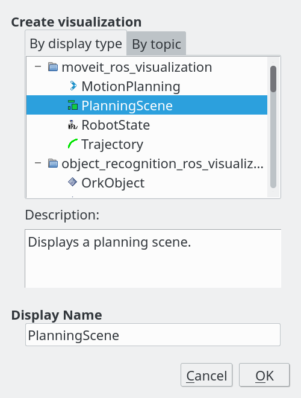

ROSには多くの便利な機能が用意されています。ここでは、そのうちのよく利用するコマンドなどの一部を紹介します。

## roslaunch

[ROSの基本操作](ros_basics.html)では、roslaunchの利点を説明しました。launchファイルはXMLフォーマットであり、いくつかのタグが利用可能です。以下はよく利用するタグです。

### `node`タグ

起動するノードを指定します。nodeタグの各属性の意味は下記の通りです。

`name`
: ノードインスタンスの名

`pkg`
: ノードを定義するパッケージ名

`type`
: ノードの実行ファイル名（バイナリーやPythonスクリプト）

`output`
: ノードの`stdout`の先：定義しないと`stdout`（`ROS_INFO`や`std::cout`への出力等）は端末で表示されず、`~/.ros/log/`に保存されるログファイルだけに出力される。端末で表示したい場合は`screen`にします。

### `param`タグ

パラメータサーバーにパラメータを設定します。起動されるノードはこのパラメータが利用できます。

`param`は`<launch>`、`</launch>`の間に入れると、グローバルパラメータになる全ノードが利用できます。`<node>`、`</node>`の間に入れるとプライベートパラメータになり、そのノードだけが利用できます。

各属性は下記の通りです。

`name`
: パラメータ名

`value`
: パラメータの値

`type`
: double, int, string, bool など (一意に決まるときは省略可能)

### `rosparam`タグ

`param`タグと同様にパラメータサーバーにパラメータを設定するが、パラメータの名と値はファイルやコマンドの出力できめます。下記のようにYAMLファイルから複雑なパラメータをロードするために便利です。

```xml
<rosparam file="$(find crane_plus_hardware)/config/servo_controller_manager.yaml" command="load"/>
```

### `remap`タグ

ノードとトピックをつなぎ変えます。

remapタグの各属性の意味は下記の通りです。

`from`
: 変更前のトピック名

`to`
: 変更後のトピック名

これを使うことで、ノードとトピックをつなぎ変えることができます。たとえば、下記のような、動作計画のノードと、ロボットのドライバノードがつながっている状態から、新たに衝突回避のノードを加えたいとします。


remapを用いることで、各ノードのソースコードを変更することなく、ノードとトピックの接続だけ切り替えて、動作計画とロボットドライバの間に、衝突回避を追加することができます。


## rqt_graph

トピックとノードの接続状態を可視化することができます。ロボットをPCに接続して、[マニピュレータの制御とMoveIt!の利用](manipulators_and_moveit.html)で説明したようにシステムを実行し、その状態で下記コマンドを実行してみましょう。

```shell
$ rqt_graph
```

以下の画像のように、ノードとトピックの接続グラフが表示されます。


## rostopic

デバッグなどのため、ROSのトピックに流れているメッセージを確認したいときや、試しにメッセージを送信したいときに、コマンドラインのツールでこれらの処理を行うことができます。

- 存在するトピックを確認する

```shell
$ rostopic list
/attached_collision_object
/camera/camera_info
/camera/image_raw
/camera/image_raw/compressed
/camera/image_raw/compressed/parameter_descriptions
/camera/image_raw/compressed/parameter_updates
/camera/image_raw/compressedDepth
/camera/image_raw/compressedDepth/parameter_descriptions
/camera/image_raw/compressedDepth/parameter_updates
/camera/image_raw/theora
/camera/image_raw/theora/parameter_descriptions
/camera/image_raw/theora/parameter_updates
/collision_object
/crane_plus/command
/crane_plus/follow_joint_trajectory/cancel
/crane_plus/follow_joint_trajectory/feedback
/crane_plus/follow_joint_trajectory/goal
/crane_plus/follow_joint_trajectory/result
/crane_plus/follow_joint_trajectory/status
/crane_plus/state
/crane_plus_gripper/gripper_command/cancel
/crane_plus_gripper/gripper_command/feedback
/crane_plus_gripper/gripper_command/goal
/crane_plus_gripper/gripper_command/result
/crane_plus_gripper/gripper_command/status
/diagnostics
/elbow_servo_controller/command
/elbow_servo_controller/state
/execute_trajectory/cancel
/execute_trajectory/feedback
/execute_trajectory/goal
/execute_trajectory/result
/execute_trajectory/status
/finger_servo_controller/command
/finger_servo_controller/state
/joint_states
/motor_states/dxl_tty1
/move_group/cancel
/move_group/display_contacts
/move_group/display_planned_path
/move_group/feedback
/move_group/goal
/move_group/monitored_planning_scene
/move_group/ompl/parameter_descriptions
/move_group/ompl/parameter_updates
/move_group/plan_execution/parameter_descriptions
/move_group/plan_execution/parameter_updates
/move_group/planning_scene_monitor/parameter_descriptions
/move_group/planning_scene_monitor/parameter_updates
/move_group/result
/move_group/sense_for_plan/parameter_descriptions
/move_group/sense_for_plan/parameter_updates
/move_group/status
/move_group/trajectory_execution/parameter_descriptions
/move_group/trajectory_execution/parameter_updates
/pickup/cancel
/pickup/feedback
/pickup/goal
/pickup/result
/pickup/status
/place/cancel
/place/feedback
/place/goal
/place/result
/place/status
/planning_scene
/planning_scene_world
/rosout
/rosout_agg
/shoulder_flex_servo_controller/command
/shoulder_flex_servo_controller/state
/shoulder_revolute_servo_controller/command
/shoulder_revolute_servo_controller/state
/tf
/tf_static
/trajectory_execution_event
/wrist_servo_controller/command
/wrist_servo_controller/state
```

- 一つのトピックに流れているメッセージを確認する

```shell
$ rostopic echo /joint_states
header:
  seq: 12510
  stamp:
    secs: 1495596313
    nsecs:  93947887
  frame_id: ''
name: ['crane_plus_shoulder_flex_joint']
position: [-0.9612946270750019]
velocity: [0.0]
effort: [0.0]
---
header:
  seq: 12511
  stamp:
    secs: 1495596313
    nsecs: 141926050
  frame_id: ''
name: ['crane_plus_moving_finger_joint']
position: [0.5471198143458788]
velocity: [0.0]
effort: [0.0]
---
header:
  seq: 12512
  stamp:
    secs: 1495596313
    nsecs: 125914096
  frame_id: ''
name: ['crane_plus_wrist_joint']
position: [-1.1198059751565181]
velocity: [0.0]
effort: [0.0]
[Ctrl+c]
```

- 一つのトピックにメッセージを送信する

  __Tab__{: style="border: 1px solid black" } でトピック名、データ型及びメッセージのテンプレートが出せます。

```shell
$ rostopic pub -1 /block geometry_msgs/Pose2D "{x: 0.2, y: 0.0}"
publishing and latching message for 3.0 seconds
```

  `-1`を利用すると一回のみ送信します。`-1`を削除すると`rostopic`は __Ctrl+c__{: style="border: 1px solid black" } を入力するまでに送信し続きます。

## RViz

ROSでは、RVizという、データ可視化ツール(ビューワ)が提供されています。今回のセミナーの環境にも、インストールされており、マニピュレータの姿勢等を表示することができます。ロボットをPCに接続して、[マニピュレータの制御とMoveIt!の利用](manipulators_and_moveit.html)で説明したようにシステムを実行し、その状態で下記コマンドを実行してみましょう。

```shell
$ rviz
```

RVizでカメラの制御は以下で行います。

マウスをクリックとドラッグ
: 青い点を中心にしてカメラの回転

__Shift__{: style="border: 1px solid black" } を押しながらマウスをクリックとドラッグ　または　マウスをミドルクリックとドラッグ
: 青い点を中心にしてカメラをXYで移動する

マウスウィール　または　マウス右クリックとドラッグ
: 青い点を中心にしてカメラズーム

まずは、RVizにどの座標系でデータを表示するか指定することが必要です。RViz画面中の「Fixed Frame」の右側で`base_link`を選択します。


これからRViz上でデータを可視化できます。マニピュレータの姿勢を表示しましょう。RViz画面中の「add」ボタンをクリックし、開いた選択ウィンドー内で「By display type」タブから「TF」を選択します。


CRANE+はたくさんのタスクフレームを持つので、前フレームを表示すると見にくいです。左側のパネルで表示されているデータの表示方法等が変更できます。フレームを少し減らしましょう。


しかし、タスクフレームが見えてもまだ分かりにくいです。ロボット自体が見えたらより分かりやすいです。このためにRVizはロボットモデルの表示ができます。「add」ボタンをクリックし、「RobotModel」を選択します。


レーザーセンサーやロボットの道などのような他のセンサーデータなども表示できます。以下はカメラからのデータを表示する例です。


## rosbag

ROSで提供されている`rosbag`ツールを用いると、ROS上で送信、受信されているデータ(メッセージ)を記録・再生することができます。

- データを記録（マニピュレータの一つのサーボステートとロボットの前ジョイントステートを記録する例）

  ```shell
  $ rosbag record /elbow_servo_controller/state /joint_states
  ```

  記録の終了は、__Ctrl+c__{: style="border: 1px solid black" } で行います。記録されたデータは、「日付時刻.bag」のファイル名で保存されています。 

- データを再生する

  ```shell
  $ rosbag play ファイル名.bag
  ```

## シミュレータ

ロボットハードウェアの制御には大きな弱点があります：制御ソフトウェアにエラーがあれば高いハードウェアを壊す可能性があります。

そのリスクを防ぐためにシミュレータの利用がおすすめです。ROSで[Gazebo](http://gazebosim.org/)というシミュレータの利用が基本です。

以下の実行でCRANE+のシミュレーションを起動します。

```shell
$ roslaunch crane_plus_simulation simulation.launch
```


Gazeboでカメラの制御は以下で行います。

マウスをクリックとドラッグ
: クリックした点を中心にしてカメラをXZで移動する

__Shift__{: style="border: 1px solid black" } を押しながらマウスをクリックとドラッグ　または　マウスをミドルクリックとドラッグ
: クリックした点を中心にしてカメラの回転

マウスウィール　または　マウス右クリックとドラッグ
: クリックした点を中心にしてカメラズーム（注意：シミュレータ世界の点ので、遠いところにクリックしてズームするとカメラが急に遠くなる）

次にMoveIt!を起動します。新しい端末で以下を実行します。

```shell
$ cd ~/crane_plus_ws/
$ source devel/setup.bash
$ roslaunch crane_plus_moveit_config move_group.launch
... logging to /home/username/.ros/log/7b527712-3aa3-11e7-b868-d8cb8ae35bff/roslaunch-alnilam-3483.log
Checking log directory for disk usage. This may take awhile.
Press Ctrl-C to interrupt
Done checking log file disk usage. Usage is <1GB.

started roslaunch server http://alnilam:33499/

SUMMARY
（省略）
[ INFO] [1494986092.617635076, 141.869000000]: MoveGroup context initialization complete

You can start planning now!
```

最後に「You can start planning now!」が出力されたら、マニピュレータは利用可能な状態になりました。

MoveIt!は、ROSノードでMoveIt!のAPIを利用することが基本の利用方法です。しかし、試すだけのためにノードを利用するや手動制御の時、ノードの利用は重い作業です。）ノードを作成の代わりにROSの基本の可視化ツール[RViz](http://wiki.ros.org/rviz)も利用できます。

MoveIt!はRViz上でマニピュレータ制御ユーザーインターフェースをプラグインとして提供します。MoveIt!と同時にインストールされて、CRANE+のMoveIt!パッケージから起動します。新しい端末で以下を実行してRVizのMoveIt!ユーザーインターフェースを起動します。

```shell
$ cd ~/crane_plus_ws/
$ source devel/setup.bash
$ roslaunch crane_plus_moveit_config moveit_rviz.launch
```


RVizでカメラの制御は以下で行います。

マウスをクリックとドラッグ
: 青い点を中心にしてカメラの回転

__Shift__{: style="border: 1px solid black" } を押しながらマウスをクリックとドラッグ　または　マウスをミドルクリックとドラッグ
: 青い点を中心にしてカメラをXYで移動する

マウスウィール　または　マウス右クリックとドラッグ
: 青い点を中心にしてカメラズーム

RViz内の「Motion Planning」パネルにある「Planning」タブをクリックして、以下のインターフェースを開きます。


最初のテストとして、マニピュレータをランダムな姿勢に移動しましょう。Planningタブ内の「Select Goal State」で「`<random valid>`」が選択されているを確認して、「Update」をクリックします。


「Plan」をクリックします。MoveIt!が移動プランを計算します。RVizでロボットが追う経路は表示されます。


プランを実行します。「Execute」をクリックするとシミュレータ上のマニピュレータが指定した姿勢に移動します。RViz上でロボットの現在の姿勢が表示され、これも指定したポーズ（すなわちシミュレータ上のロボットのポーズ）に移動します。


ランダムな姿勢に移動できたら、次に手動制御を行いましょう。RViz内でマニピュレータの先端に球体と丸と矢印があります。以下の方法でこれらを利用してグリッパーの位置と角度が制御できます。

球体をドラッグ
: グリッパーの位置を移動する。

丸を回す
: グリッパーの角度を変更する。（注意：CRANE+は4DOFのマニピュレータだけなのでグリッパーの角度は上下（緑色の丸）しか変更できない。他の角度変更は無視される。）

矢印をドラッグ
: グリッパーの位置を一つの軸だけで移動する。

基本的にMoveIt!のユーザーインターフェースは可能か姿勢しか許さないので、時々マニピュレータは移動してくれないことや飛ぶことがあります。

お好みの姿勢にグリッパーを移動して、「Plan」と「Execute」ボタンでマニピュレータを移動しましょう。シミュレータ上のロボットはグリッパーが指定した位置と角度になるように動きます。

## MoveIt!の可視化

### プラニングシーンの可視化

MoveIt!でプラニングを行う際、マニピュレータの周りの物体を考慮する機能があります。マニピュレータの周りを「planning scene」（プラニングシーン）と呼びます。

プラニングシーンの主な目的はマニピュレータが周りの物体と接触せずに移動することです。本セミナーは時間制限の上で本機能の説明を詳しくすることはできません。

でも、プラニングシーンを可視化のためにも利用できます。例えば、ブロックをピッキングする時にブロックがマニピュレータに対してどこにあるかや、下のテーブルの可視化ができます。

[マニピュレータの制御とMoveIt!の利用](manipulators_and_moveit.html)で作成したピック・アンド・プレースノードにプラニングシーンを利用して可視化を追加して本機能をデモします。

まずはヘッダーファイルです。

```c++
#include <moveit/planning_scene_interface/planning_scene_interface.h>
#include <geometry_msgs/Pose.h>
#include <moveit_msgs/CollisionObject.h>
#include <shape_msgs/SolidPrimitive.h>

#include <string>
#include <vector>
```

`PlanningSceneInterface`と`gripper`という`MoveGroup`のメンバー変数を追加します。

```c++
 private:
  moveit::planning_interface::MoveGroupInterface gripper_group_;
  moveit::planning_interface::PlanningSceneInterface scene_;
```

`SetupPlanningScene`関数を追加してクラスのコンストラクターから呼びます。

```c++
  PickNPlace(（省略）) 
    （省略）
      gripper_group_("gripper") {
    （省略）
    SetupPlanningScene();
    （省略）
  }

  void SetupPlanningScene() {
    ROS_INFO("Setting up planning scene");
    // プラニングシーンを空にする
    std::vector<std::string> objs;
    for (auto o: scene_.getObjects()) {
      objs.push_back(o.first);
    }
    for (auto o: scene_.getAttachedObjects()) {
      objs.push_back(o.first);
    }
    scene_.removeCollisionObjects(objs);

    // シーンにテーブルを追加
    moveit_msgs::CollisionObject table;
    table.header.frame_id = "base_link";
    table.id = "table";
    // テーブルの箱を指定
    shape_msgs::SolidPrimitive primitive;
    primitive.type = primitive.BOX;
    primitive.dimensions.resize(3);
    primitive.dimensions[0] = 1;
    primitive.dimensions[1] = 1;
    primitive.dimensions[2] = 0.1;
    // テーブルの姿勢
    geometry_msgs::Pose pose;
    pose.position.x = 0;
    pose.position.y = 0;
    pose.position.z = -0.05;
    pose.orientation.w = 1;
    table.primitives.push_back(primitive);
    table.primitive_poses.push_back(pose);
    // 追加
    table.operation = table.ADD;
    // テーブルの色
    std_msgs::ColorRGBA colour;
    colour.b = 0.5;
    colour.a = 1;
    // シーンに追加
    scene_.applyCollisionObject(table, colour);

    // テーブルはスポンジキューブに下にあるとしてい
    // （当たってもいいということ）
    arm_.setSupportSurfaceName("table");
  }
```

スポンジキューブが発券されたらシーンに追加する関数とシーンから削除する関数を追加します。

```c++
  void AddBoxToScene(geometry_msgs::Pose2D const& location) {
    moveit_msgs::CollisionObject sponge;
    sponge.header.frame_id = "base_link";
    sponge.id = "sponge";
    shape_msgs::SolidPrimitive primitive;
    primitive.type = primitive.BOX;
    primitive.dimensions.resize(3);
    primitive.dimensions[0] = 0.04;
    primitive.dimensions[1] = 0.04;
    primitive.dimensions[2] = 0.031;
    geometry_msgs::Pose pose;
    pose.position.x = 0.17;
    pose.position.y = 0.0;
    pose.position.z = 0.015;
    pose.orientation.w = 1;
    sponge.primitives.push_back(primitive);
    sponge.primitive_poses.push_back(pose);
    sponge.operation = sponge.ADD;
    scene_.applyCollisionObject(sponge);
    ros::Duration(1).sleep();
  }

  void RemoveBoxFromScene() {
    std::vector<std::string> objs;
    objs.push_back("sponge");
    scene_.removeCollisionObjects(objs);
  }
```

スポンジキューブが発券されたら時点、上記の関数を利用して可視化します。下記は`DoPickAndPlace`関数の最初に追加します。

```c++
    AddBoxToScene(msg);
```

下記は`DoPickAndPlace`関数の終わりに追加します。

```c++
    RemoveBoxFromScene();
```

最後に、ピッキングをする際スポンジキューブをマニピュレータに付けて、プレースをする際にマニピュレータから取ることを追加します。下記は`DoPick`のGraspの後に追加します。

```c++
    arm_.attachObject("sponge", "", gripper_group_.getLinkNames());
```

下記は`DoPlace`のReleaseの後に追加します。

```c++
    arm.detachObject("sponge");
```

上記はMoveIt!のプラニングシーンに物体を追加・削除します。これでMoveIt!はテーブルとスポンジキューブに当たらない移動経路を計算します。

そして、プラニングシーンを見るために、RVizを利用します。システムを起動した後、RVizを移動して以下のように「PlanningScene」の可視化を追加します。



以下のようにでピック・アンド・プレースの流れが可視化されました。


