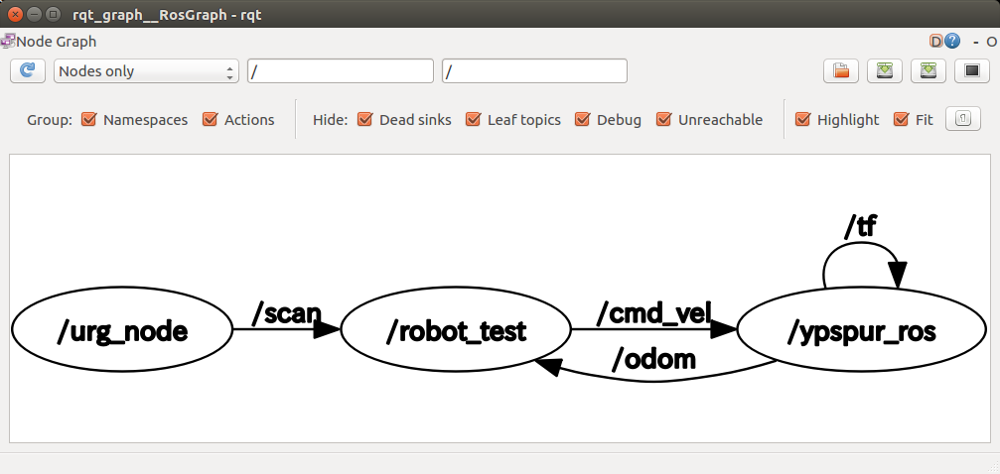
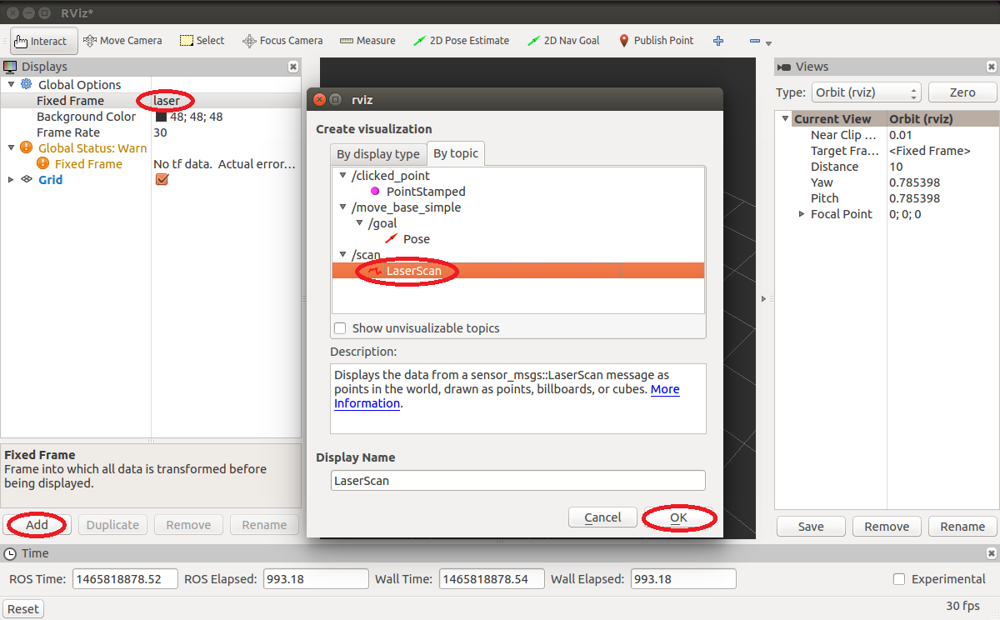
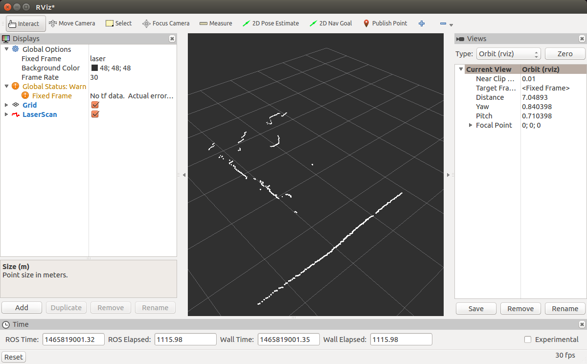

- Table of contents
{:toc}

ROSには多くの便利な機能が用意されています。ここでは、そのうちのよく利用するコマンドなどの一部を紹介します。

# roslaunch

[ROSを用いた点群取得](ros_points.html)では、
端末を4つ起動して、それぞれroscoreとrosrunコマンドでノードを起動していました。
複雑なロボットシステムではこれが、100個以上のノードになる場合もあり、手作業ではやっていられません。

そこでROSには、launchファイルに、起動するノードやそのパラメータを書いておき、
roslaunchコマンドで一括起動する方法が用意されています。
下記の操作を行い、launchファイルを追加してみましょう。

1. rsj_robot_testパッケージに、launchディレクトリを作成

```shell
   $ mkdir ~/catkin_ws/src/rsj_robot_test/launch
```

1. robot_test.launchファイルを作成して開く

```shell
   $ gedit ~/catkin_ws/src/rsj_robot_test/launch/robot_test.launch
```

1. 下記内容を記入

```xml
   <launch>
   	<node pkg="ypspur_ros" type="ypspur_ros" name="ypspur_ros">
   		<param name="port" value="/dev/serial/by-id/usb-T-frog_project_T-frog_Driver-if00" />
   		<param name="param_file" value="/home/$(env USER)/params/rsj-seminar20??.param該当するものに置き換えること" />
   	</node>
   	<node pkg="urg_node" type="urg_node" name="urg_node">
   		<param name="serial_port" value="/dev/serial/by-id/usb-Hokuyo_Data_Flex_for_USB_URG-Series_USB_Driver-if00" />
   	</node>
   	<node pkg="rsj_robot_test" type="rsj_robot_test_node" name="robot_test" output="screen">
   	</node>
   </launch>
```

作成したlaunchファイルは下記のコマンドで実行できます。

```shell
$ roslaunch rsj_robot_test robot_test.launch
```

これは、rsj_robot_testパッケージ中の、robot_test.launchを実行する、という指示を表しています。
下記に代表的なタグの説明を示します。

## `node`タグ

動するノードを指定します。nodeタグの各属性の意味は下記の通りです。

`name`
: ノードインスタンスの名

`pkg`
: ノードを定義するパッケージ名

`type`
: ノードの実行ファイル名（バイナリーやPythonスクリプト）

`output`
: ノードの`stdout`の先：定義しないと`stdout`（`ROS_INFO`や`std::cout`への出力等）は端末で表示されず、
`~/.ros/log/`に保存されるログファイルだけに出力される。端末で表示したい場合は`screen`にします。

## `param`タグ

パラメータサーバーにパラメータを設定します。起動されるノードはこのパラメータが利用できます。

`param`は`<launch>`、`</launch>`の間に入れると、グローバルパラメータになる全ノードが利用できます。
`<node>`、`</node>`の間に入れるとプライベートパラメータになり、そのノードだけが利用できます。

各属性は下記の通りです。

`name`
: パラメータ名

`value`
: パラメータの値

`type`
: double, int, string, bool など (一意に決まるときは省略可能)

## `remap`タグ

ノードとトピックをつなぎ変えます。

remapタグの各属性の意味は下記の通りです。

`from`
: 変更前のトピック名

`to`
: 変更後のトピック名

これを使うことで、ノードとトピックをつなぎ変えることができます。たとえば、下記のような、動作計画のノードと、ロボットのドライバノードがつながっている状態から、
新たに衝突回避のノードを加えたいとします。


remapを用いることで、各ノードのソースコードを変更することなく、ノードとトピックの接続だけ切り替えて、動作計画とロボットドライバの間に、衝突回避を追加することができます。


# rqt_graph

トピックとノードの接続状態を可視化することができます。
ロボットとURGをPCに接続して、roslaunchの項で説明したようにrobot_test.launchを実行し、その状態で下記コマンドを実行してみましょう。

```shell
$ rqt_graph
```

以下の画像のように、ノードとトピックの接続グラフが表示されます。



# rostopic

デバッグなどのため、ROSのトピックに流れているメッセージを確認したいときや、
試しにメッセージを送信したいときに、コマンドラインのツールでこれらの処理を行うことができます。

- 存在するトピックを確認する

```shell
$ rostopic list
＊＊＊！！！実行時のトピックを追加！！！＊＊＊
```

- １つのトピックに流れているメッセージを確認する

```shell
$ rostopic echo /ypspur_ros/odom
```

- １つのトピックにメッセージを送信する

__Tab__{: style="border: 1px solid black" } でトピック名、データ型及びメッセージのテンプレートが出せます。

```shell
$ rostopic pub -1 /ypspur_ros/cmd_vel geometry_msgs/Twist [Tab補完で表示]"linear
  x: 0.0
  y: 0.0
  z: 0.0
angular:
  x: 0.0
  y: 0.0
  z: 0.0"
```

`-1`を利用すると一回のみ送信します。`-1`を削除すると`rostopic`は __Ctrl+c__{: style="border: 1px solid black" } を入力するまでに送信し続きます。

# rosbag

ROSで提供されている`rosbag`ツールを用いると、ROS上で送信、受信されているデータ(メッセージ)を記録・再生することができます。

- データを記録 (URGのデータ /scan と、オドメトリ /odom を記録する例)

```shell
$ rosbag record /scan /odom
```

記録の終了は、__Ctrl+c__{: style="border: 1px solid black" } で行います。記録されたデータは、「日付時刻.bag」のファイル名で保存されています。

- データを再生する

```shell
$ rosbag play ファイル名.bag
```

# RViz

ROSでは、rvizという、データ可視化ツール(ビューワ)が提供されています。
今回のセミナーの環境にも、インストールされており、URGのデータやオドメトリを表示することができます。
ロボットとURGをPCに接続して、roslaunchの項で説明したようにrobot_test.launchを実行し、その状態で下記コマンドを実行してみましょう。

```shell
$ rosrun rviz rviz
```
rviz画面中の、「add」ボタンをクリックし、開いた選択ウインドウ内で、
「By topic」タブから、「/scan」中の「LaserScan」を選択します。
また、「Global Option」の「Fixed Frame」欄に「laser」と入力します。


センサデータが取得できていれば、図のように、距離データがプロットされます。


# 小課題

配布された3次元距離センサのデータについて、
roslounchを利用して2次元データに変換し、RVizで結果を確認してみましょう。

- [YVT-35LXの場合](ros_3durg.html)
- [Xtion Pro Liveの場合](ros_xtion.html)
