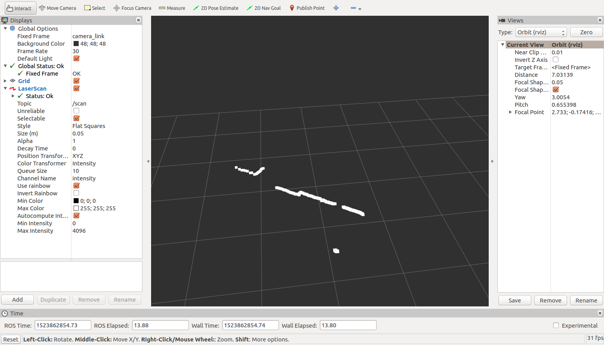

# Xtion PRO Live からのデータ取得

## パッケージのインストール

```shell
$ sudo apt install ros-kinetic-openni2-camera
$ sudo apt install ros-kinetic-openni2-launch
$ sudo apt install ros-kinetic-pointcloud-to-laserscan 
```

## 3次元から2次元への変換ソフトのダウンロード

```shell
$ cd ~/catkin_ws/src
$ git clone https://github.com/KMiyawaki/rsj_pointcloud_to_laserscan.git
```

## 動作確認

PC の USB ポートに Xtion PRO Live を接続し、次のコマンドを実行します。

```shell
$ cd ~/catkin_ws/
$ source devel/setup.bash
$ cd src/rsj_pointcloud_to_laserscan/launch
$ roslaunch rsj_pointcloud_to_laserscan.launch
```

コンソールに赤字でエラーメッセージが出ていないかどうか確認してください。
もしエラーメッセージが出ていたら、プログラムを __Ctrl+c__{: style="border: 1px solid black" } で終了し、 Xtion PRO Live を USB ポートから一旦抜いて再接続してからもう一度上記を実行してみてください。

### データの表示

別のコマンドターミナルを開き次を実行してください。

```shell
$ cd ~/catkin_ws/src/rsj_pointcloud_to_laserscan/config/rviz
$ rosrun rviz rviz -d view_scan.rviz
```

下図のように2次元の点群が表示されれば成功です。


